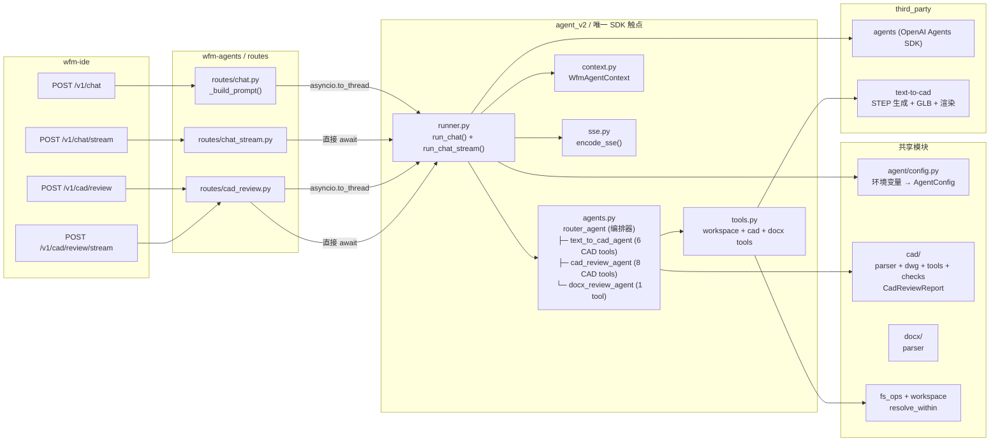

# ARCH_AGENT_SDK_NATIVE — 对话后端（OpenAI Agents SDK 原生方案）

> ⚠️ **状态：已废弃（DEPRECATED, 2026-05-22）**
>
> 对话后端已从 OpenAI Agents SDK 迁移至 **Claude Code CLI + MCP 工具服务器**架构。本文描述的 Router Agent + Handoff + `@function_tool` 模式已不再使用。当前架构文档请参考 [`wfm-agents/README.md`](../wfm-agents/README.md)。
>
> **当前架构要点**：
> - `agent_v2/claude_runner.py`：通过子进程调用 `claude -p <prompt> --output-format stream-json --verbose`
> - `agent_v2/wfm_mcp_server.py`：MCP 工具服务器，所有 workspace/CAD/DOCX 工具注册为 `@mcp.tool()`
> - 不再有 `router_agent` / `handoffs` / `Agent()` 定义——Claude Code CLI 自主决定调用哪些工具
> - 不再有 `WfmAgentContext` / `RunContextWrapper`——workspace_root 通过 `WFM_WORKSPACE_ROOT` 环境变量注入 MCP 服务器
> - 配置从 `WFM_OPENAI_API_KEY` + `WFM_AGENT_MODEL` 简化为单个 `WFM_CLAUDE_MODEL`（默认 `sonnet`）
> - SSE 事件契约基本兼容（保留 `session` / `text_delta` / `tool_call_started` / `tool_call_done` / `error` / `done`），新增 `thinking_delta` / `cad_edit`

> **版本**：v2.0（2026-05-19，Router Agent + Handoff 架构；新增 text_to_cad_agent）
> **关联**：
> - `ARCH_AGENT_GATEWAY.md`（**已废弃**，保留为历史背景）
> - `DEV_AGENT_GATEWAY.md`（**已废弃**，保留为历史背景）
> - **[ARCH_CAD_REVIEW_AGENT.md](ARCH_CAD_REVIEW_AGENT.md)**（CAD 审图工具化架构设计 v1.0 — cad_review_agent 的工具集、prompt、数据流定义）
> - `ARCH_CAD_REVIEW.md`（CAD 浏览 + 审图 v0.2，前端与字体管线不变；后端审图部分已被 ARCH_CAD_REVIEW_AGENT.md 取代）
> - `CAD_AI_SELECTION_REVIEW.md`（选区审图，L1 在本架构上落地）
> - `CAD_AI_FEASIBILITY.md`（能力边界与期望管理）
> - `ARCH_DOCX_REVIEW.md`（DOCX 审阅，同类 agent 模式）
> - **[ARCH_RENDER_PIPELINE.md](ARCH_RENDER_PIPELINE.md)**（STEP → PNG 渲染管线技术选型与依赖说明）

---

## 0. 一句话

**`wfm-agents` 的所有对话流量都进同一个基于 OpenAI Agents SDK 的 `router_agent`。Router 根据意图通过 SDK 原生 `handoff` 机制委托给专用 Agent（text_to_cad / cad_review / docx_review），不再在 route 层或 runner 层做 if/else 分发。新增能力只需定义 Agent + 注册到 router 的 `handoffs` 列表。**

---

## 1. 为什么换

旧实现（`agent/` 包下）做的事：

- 手写 `runner.py` tool loop（`responses.create` + `function_call_output` 循环）
- `client.py` 维护 `openai.OpenAI / AsyncOpenAI` 工厂
- `session_store.py` 管理会话状态
- `recipes/` 用 `Recipe` Protocol 区分对话模式
- `tools/adapter.py` + `tools/invoke.py` 把 builtin 工具转成 SDK tool 字典
- `events.py` SSE 事件编码
- `fallback.py` 降级链

旧实现**没覆盖**或被削平成「最大公约数」的能力：

- OpenAI **Responses API** 与 **`previous_response_id` 状态托管** — 手写循环无法正确串联
- **Structured Outputs** (Pydantic ↔ JSON Schema) — 需要手动 `model_validate_json`
- **多模态** (`input_image` / `image_url`) — Recipe 抽象未预留
- **Agent handoff / guardrails / tracing** — Agents SDK 内建，手写循环全无
- **SDK 内置重试 / `max_retries` / 错误类型分类** — 需要自行实现

**判断**：在产品当前阶段（单上游 OpenAI 兼容生态 + 多个真实场景），手写 runner 的 ROI 为负。切换到 OpenAI Agents SDK（`third_party/agents/openai-agents-python`）后，Agent 定义、工具注册、流式事件、多轮 tool calling 全部由 SDK 处理，`agent_v2/` 只做业务胶水。

v2.0 进一步引入 **Router Agent + Handoff** 架构：route 层只做结构化文件检测（快速可靠），把上下文注入 prompt；Runner 统一发给 `router_agent`，由 LLM 根据意图决定 handoff 到哪个专用 Agent。

---

## 2. 设计原则

1. **SDK 原生**：唯一持有 `agents.Runner` 的地方是 `agent_v2/runner.py`。路由层和其它模块永远不直接 import `agents`。
2. **Router + Handoff**：`router_agent` 是唯一的入口 Agent，通过 SDK `handoffs` 列表注册所有专用 Agent。Runner 层不做 if/else 分发。
3. **Agent 即 Recipe**：旧 `Recipe` Protocol 由 SDK 的 `Agent(name, instructions, tools, handoff_description)` 替代。一个 Agent 定义 = 一组 system prompt + 工具集 + 行为参数。
4. **`@function_tool` 注册**：旧 `ToolSpec` + `adapter.py` 由 SDK 的 `@function_tool` 装饰器替代。工具函数签名即 schema，无需手动构造 JSON Schema。
5. **两个入口**：`run_chat()`（同步）和 `run_chat_stream()`（异步流式）是唯二的公开函数。所有路由都走这两个入口。
6. **SSE 流式展示**：IDE 使用 `POST /v1/chat/stream` SSE 端点，实时展示 Agent 执行中间状态（工具调用、Agent 切换）并流式输出文本。同步 `POST /v1/chat` 保留作为降级回退。HTTP 请求/响应包络（`ChatRequest` / `ChatReply`）保持兼容。
7. **配置共享**：`agent/config.py`（环境变量加载）继续被 `agent_v2` 使用，不重复实现。
8. **GLM-5.1 兼容**：`OpenAIProvider(use_responses=False)` 走 Chat Completions API；手动 `_parse_cad_review()` 剥离 markdown code fences 后再做 schema 校验。
9. **可扩展**：新增能力只需三步——(1) 在 `agents.py` 定义新 Agent + `handoff_description`；(2) 在 `router_agent.handoffs` 列表加入；(3) 在 router 系统提示词中补充选择规则。不需要改 route 层、runner、ChatRequest。

---

## 3. 总体架构



**核心不变量**：

- 路由层**只做**参数校验 + 结构化文件检测（CAD/DOCX）+ 上下文注入 prompt。不做 Agent 选择。
- `runner.py` 是**唯一** import `agents.Runner` 的模块。所有请求统一发给 `router_agent`。
- 工具函数通过 `RunContextWrapper[WfmAgentContext]` 拿到 `workspace_root`，所有路径操作走 `resolve_within()`。

---

## 4. 模块布局

```
wfm-agents/wfm_agents/
├── agent/                         ← 旧包（已废弃，仅保留 config）
│   ├── __init__.py                # 废弃声明
│   └── config.py                  # 环境变量 → AgentConfig（被 agent_v2 使用）
│
├── agent_v2/                      ← 新对话主链路
│   ├── __init__.py                # 模块 docstring
│   ├── agents.py                  # Agent 定义：router_agent, text_to_cad_agent, cad_review_agent, docx_review_agent
│   ├── context.py                 # WfmAgentContext(workspace_root: str)
│   ├── tools.py                   # workspace + cad + docx @function_tool
│   ├── sse.py                     # SSE 事件常量 + encode_sse()
│   ├── runner.py                  # run_chat() / run_chat_stream() — 唯一入口
│   └── router.py                  # /v1/chat/v2 PoC 路由（非主链路，仅供对比测试）
│
├── routes/                        ← FastAPI 路由层
│   ├── chat.py                    # POST /v1/chat → _build_prompt() → asyncio.to_thread(run_chat, ...)
│   ├── chat_stream.py             # POST /v1/chat/stream → _build_prompt() → run_chat_stream(...)
│   └── cad_review.py              # POST /v1/cad/review + /v1/cad/review/stream
│
├── cad/                           ← CAD 业务逻辑（工具化重构后）
│   ├── __init__.py                # export
│   ├── parser.py                  # 粒度化子函数：overview / texts / dims / blocks / layer
│   ├── dwg.py                     # DWG→DXF 转换（ezdxf recover + LibreDWG CLI fallback）
│   ├── tools.py                   # 8 个 @function_tool（cad_file_read / cad_extract_* / cad_check_*）
│   ├── checks.py                  # 命名规范、标题块、标注精度等检查逻辑
│   ├── recipes.py                 # format_summary_text()（保留兼容，route 层不再调用）
│   └── review/
│       ├── __init__.py
│       └── schema.py              # CadReviewReport + render_markdown()
│
├── docx/                          ← DOCX 解析
│   ├── __init__.py
│   └── parser.py                  # python-docx 解析 → 结构化 dict
│
├── fs_ops.py                      # read_text / write_text
├── workspace.py                   # resolve_within / resolve_workspace_root
└── observability/
    └── errors.py                  # 错误码常量
```

**已删除**（不在仓库中）：

| 旧模块 | 说明 |
|--------|------|
| `agent/runner.py` | 手写 tool loop，被 `agent_v2/runner.py` 替代 |
| `agent/client.py` | OpenAI client 工厂，被 SDK `OpenAIProvider` 替代 |
| `agent/session_store.py` | 会话状态，当前不需要（无跨轮状态） |
| `agent/recipes/` | `Recipe` Protocol + 实现类，被 `Agent` 替代 |
| `agent/tools/adapter.py` | `ToolSpec → dict`，被 `@function_tool` 替代 |
| `agent/tools/invoke.py` | 工具执行路由，被 SDK 内建 tool 执行替代 |
| `agent/events.py` | SSE 编码，被 `agent_v2/sse.py` 替代 |
| `agent/fallback.py` | 降级链，当前由 `WFM_AGENT_API=chat` 配置替代 |
| `cad/render_step.py` | 自定义 VTK 渲染器，被 third_party/text-to-cad 渲染管线替代 |

---

## 5. 配置（环境变量，统一前缀 `WFM_AGENT_*` / `WFM_OPENAI_*`）

环境变量由 `agent/config.py` 的 `load_config()` 统一加载，返回不可变 `AgentConfig` dataclass。

| 环境变量 | 必填 | 默认值 | 说明 |
|----------|------|--------|------|
| `WFM_OPENAI_API_KEY` | 是 | — | 也可 fallback 到 `OPENAI_API_KEY` |
| `WFM_OPENAI_BASE_URL` | 否 | `None` | DashScope / DeepSeek / GLM 等兼容层地址 |
| `WFM_AGENT_MODEL` | 否 | `gpt-4.1-mini` | 主模型；也接受 `WFM_OPENAI_MODEL` |
| `WFM_AGENT_FALLBACKS` | 否 | `""` | 逗号分隔备选模型（当前未使用） |
| `WFM_AGENT_API` | 否 | `responses` | `responses` = Responses API；`chat` = Chat Completions API |
| `WFM_AGENT_TEMP` | 否 | `0.3` | 默认温度 |
| `WFM_AGENT_TIMEOUT` | 否 | `120` | 请求超时（秒） |
| `WFM_AGENT_RETRIES` | 否 | `2` | SDK 内置 max_retries |
| `WFM_AGENT_MAX_TOOL_ROUNDS` | 否 | `8` | Runner 最大 tool calling 轮数（防止无限重试，建议 ≤ 20） |
| `WFM_AGENT_SESSION_TTL_SEC` | 否 | `3600` | 会话 TTL（预留，当前无状态存储） |
| `WFM_AGENT_ALLOW_IMAGE` | 否 | `false` | 多模态总开关（预留） |

**阿里云百炼 + GLM-5.1 典型配置**（当前生产配置）：

```bash
WFM_OPENAI_API_KEY=<dashscope-api-key>
WFM_OPENAI_BASE_URL=https://dashscope.aliyuncs.com/compatible-mode/v1
WFM_AGENT_MODEL=glm-5.1
WFM_AGENT_API=chat          # GLM 不支持 Responses API
```

---

## 6. Agent 定义（Router + Handoff 架构）

SDK 的 `Agent` 类替代了旧的 `Recipe` Protocol。通过 `handoffs` 列表实现 Agent 间委托。

### 6.1 Router Agent（编排器）

```python
router_agent: Agent[WfmAgentContext] = Agent(
    name="wfm.router",
    instructions=_SYSTEM_ZH_ROUTER,
    tools=builtin_tools,              # [workspace_read, workspace_write, cad_convert_format]
    handoffs=[
        text_to_cad_agent,
        cad_review_agent,
        docx_review_agent,
    ],
    tool_use_behavior="run_llm_again",
)
```

Router 的系统提示词包含选择规则：
- 用户要求 **生成/创建/设计 3D 模型或零件** → `transfer_to_text_to_cad`
- 用户要求 **审图/审查图纸** 且消息中包含 CAD 文件路径 → `transfer_to_cad_review`
- 用户要求 **核对金额/审阅标书/审阅Word文档** → `transfer_to_docx_review`
- 用户要求 **转换 DWG 为 DXF** → 直接调用 `cad_convert_format` 工具，不需要 transfer
- 一般问答、文件读写 → router 直接回答

### 6.2 专用 Agent

| Agent Name | 变量 | 工具集 | handoff_description |
|---|---|---|---|
| `text_to_cad` | `text_to_cad_agent` | `cad_tools`（6 个：workspace_read/write + cad_generate_step + cad_inspect + cad_render + cad_export_dxf） | 生成3D CAD模型（STEP格式） |
| `cad_review` | `cad_review_agent` | `cad_review_tools`（8 个 CAD 审图工具，定义在 `cad/tools.py`） | 审查CAD图纸（DXF/DWG） |
| `docx_review` | `docx_review_agent` | `[docx_read]` | 审阅Word文档（金额核对） |

所有 Agent 使用 `tool_use_behavior="run_llm_again"`。

### 6.3 text_to_cad_agent 工作流程

1. 理解用户建模需求，确认关键尺寸参数
2. 编写 build123d Python 源文件，通过 `workspace_write` 保存到 `cad_generated/` 目录
3. 调用 `cad_generate_step` 编译生成 STEP 文件（third_party/text-to-cad `scripts/step`，同时生成 GLB artifact）
4. 如果编译失败，阅读错误信息，修改源文件后重试（最多 3 次）
5. 编译成功后，调用 `cad_render` 渲染预览图（third_party/text-to-cad `scripts/render view`，Playwright + Three.js WebGL）
6. 向用户报告结果：源文件路径、STEP 文件路径、预览图路径

### 6.4 关键区别

| 旧 Recipe | 新 Agent |
|-----------|----------|
| `Recipe(Protocol)` + `id` / `temperature` / `response_schema` 等字段 | `Agent(name, instructions, tools, handoff_description)` — SDK 原生 |
| `build_system()` 返回 prompt 字符串 | `instructions` 直接是字符串 |
| `build_user_blocks()` 拼装 content blocks | Route 层拼 prompt（`_build_prompt()`），Agent 不感知 |
| `response_schema: type[BaseModel]` | 不使用 SDK `output_type`（GLM 兼容），改为手动 parse |
| `tools_enabled: bool` | `tools=[...]` 传入 `@function_tool` 列表 |
| Runner if/else 分发到不同 Agent | Router Agent 通过 handoff 自动委托 |

---

## 7. 工具注册（`@function_tool`）

旧模式：`ToolSpec` dataclass → `adapter.py` 转 SDK tool 字典 → `invoke.py` 路由执行。

新模式：`@function_tool` 装饰器，函数签名即 schema，SDK 自动处理调用和序列化。

```python
from agents import RunContextWrapper, function_tool

@function_tool
def workspace_read(ctx: RunContextWrapper[WfmAgentContext], path: str) -> str:
    """Read a UTF-8 text file inside the workspace.

    Args:
        path: Relative path to the file within the workspace.
    """
    return read_text(ctx.context.workspace_root, path)
```

### 7.1 agent_v2/tools.py — 通用 + CAD 建模 + DOCX 工具

| 工具名 | 分类 | 归属 Agent | 说明 |
|--------|------|-----------|------|
| `workspace_read` | Builtin | router, text_to_cad | 读工作区内文本文件 |
| `workspace_write` | Builtin | router, text_to_cad | 写工作区内文本文件 |
| `cad_convert_format` | CAD 格式 | router | DWG → DXF 格式转换 |
| `cad_generate_step` | CAD 建模 | text_to_cad | build123d Python 源码 → STEP + GLB |
| `cad_inspect` | CAD 建模 | text_to_cad | STEP 几何检查（facts/planes/positioning） |
| `cad_render` | CAD 建模 | text_to_cad | STEP → PNG 渲染（Playwright + Three.js WebGL） |
| `cad_export_dxf` | CAD 建模 | text_to_cad | Python 源码 → DXF 导出 |
| `docx_read` | DOCX | docx_review | 解析 .docx 文件（段落 + 表格） |

### 7.2 cad/tools.py — CAD 审图工具

| 工具名 | 层级 | 说明 |
|--------|------|------|
| `cad_file_read` | Tier 1 总览 | 读取 CAD 文件总览摘要（图层、实体统计、标题块等） |
| `cad_extract_texts` | Tier 2 深挖 | 提取文字内容（TEXT/MTEXT），可按图层过滤 |
| `cad_extract_dims` | Tier 2 深挖 | 提取标注信息（DIMENSION），可按图层过滤 |
| `cad_extract_blocks` | Tier 2 深挖 | 提取块定义（BLOCK） |
| `cad_layer_inspect` | Tier 2 深挖 | 深入检查单个图层 |
| `cad_check_naming` | Tier 3 专项 | 检查图层/块命名规范 |
| `cad_check_titleblock` | Tier 3 专项 | 检查标题块字段完整性和格式 |
| `cad_check_dim_accuracy` | Tier 3 专项 | 检查标注值与几何测量是否一致 |

### 7.3 工具集导出

```python
# agent_v2/tools.py 底部
builtin_tools = [workspace_read, workspace_write, cad_convert_format]
cad_tools = [workspace_read, workspace_write, cad_generate_step, cad_inspect, cad_render, cad_export_dxf]
docx_tools = [workspace_read, workspace_write, docx_read]  # 未使用，docx_review_agent 只用 [docx_read]

# cad/tools.py 底部
cad_review_tools = [
    cad_file_read, cad_extract_texts, cad_extract_dims, cad_extract_blocks,
    cad_layer_inspect, cad_check_naming, cad_check_titleblock, cad_check_dim_accuracy,
]
```

> CAD 审图工具的完整定义、参数、返回格式见 [ARCH_CAD_REVIEW_AGENT.md](ARCH_CAD_REVIEW_AGENT.md) §3。DWG 文件后端处理见同文档 §4。

**安全模型**：所有工具通过 `ctx.context.workspace_root` 获取工作区根，文件路径一律 `resolve_within()` 校验，与旧版一致。

---

## 8. Runner 核心逻辑

`agent_v2/runner.py` 是整个对话后端的唯一入口。路由层只调两个函数。

### 8.1 同步入口 `run_chat()`

```python
def run_chat(
    *,
    message: str,
    workspace_root: str,
    session_id: str | None = None,
    attachments: list[dict[str, Any]] | None = None,
) -> ChatResult:
```

执行流程：

1. `load_config()` → 构建 `RunConfig`（含 `OpenAIProvider`、`ModelSettings`）。
2. 构造 `WfmAgentContext(workspace_root=...)`。
3. 如有 `attachments`，调 `_inject_attachments()` 将文件列表追加到 prompt。
4. **统一发给 `router_agent`**：`Runner.run_sync(starting_agent=router_agent, input=prompt, context=ctx, ...)`。
5. Router 自行决定是否 handoff 到专用 Agent（text_to_cad / cad_review / docx_review）。
6. 对 CAD 审图结果（`_detect_last_agent(result) == "cad_review"`）调 `_parse_cad_review()` 剥离 code fences 并校验 schema。
7. 返回 `ChatResult` dataclass。

### 8.2 流式入口 `run_chat_stream()`

```python
async def run_chat_stream(
    *,
    message: str,
    workspace_root: str,
    session_id: str | None = None,
    attachments: list[dict[str, Any]] | None = None,
) -> AsyncIterator[bytes]:
```

执行流程：

1. 同样的 config / context 构建。
2. 如有 `attachments`，调 `_inject_attachments()`。
3. 先 yield `session` 事件。
4. 调 `Runner.run_streamed(starting_agent=router_agent, ...)` 获取流。
5. 遍历 `streamed.stream_events()`，映射 SDK 事件到 SSE 事件（见 §9），包括 `agent_handoff` 事件。
6. 流结束后 yield `done` 事件。
7. 异常时 yield `error` 事件。

### 8.3 GLM-5.1 JSON 解析

```python
_FENCE_RE = re.compile(r"```(?:json)?\s*\n?(.*?)\n?\s*```", re.DOTALL)

def _parse_cad_review(text: str) -> tuple[str, dict | None]:
    m = _FENCE_RE.search(text)
    json_str = m.group(1).strip() if m else text.strip()
    data = json.loads(json_str)
    report = CadReviewReport.model_validate(data)
    return render_markdown(report), report.model_dump()
```

GLM-5.1 即使被要求输出纯 JSON 也会包裹 markdown code fences。`_parse_cad_review()` 先正则剥离，再做 schema 校验。校验失败时返回原始文本（降级为 Markdown 展示）。

### 8.4 Provider 构建

```python
def _build_run_config() -> tuple[RunConfig, int]:
    cfg = load_config()
    client = AsyncOpenAI(
        api_key=cfg.api_key,
        base_url=cfg.base_url,
        timeout=httpx.Timeout(cfg.request_timeout, connect=10.0),
    )
    provider = OpenAIProvider(
        openai_client=client,
        use_responses=cfg.use_responses_api,
    )
    return RunConfig(
        model=cfg.model,
        model_provider=provider,
        model_settings=ModelSettings(temperature=cfg.temperature),
    ), cfg.max_tool_rounds
```

- `use_responses=False` 时 SDK 走 Chat Completions API（`/chat/completions`）。
- `use_responses=True` 时 SDK 走 Responses API（`/responses`）。

### 8.5 Route 层 Prompt 组装（`_build_prompt()`）

Route 层（`routes/chat.py`）的 `_build_prompt()` 做**结构化文件检测**（快速、可靠），把检测到的上下文拼进 prompt。不做 Agent 选择。

检测逻辑：

1. **CAD 文件检测**（`_resolve_cad_file_ref()`）：
   - `dxf_text` 存在 → 写临时 .dxf → `[检测到CAD文件] 路径: <tmp_path>`
   - `cad_source_uri` 存在 → resolve → `[检测到CAD文件] 路径: <rel_path>`
   - `message` 中包含 `.dxf` / `.dwg` 路径 → resolve → `[检测到CAD文件] 路径: <rel_path>`
2. **DOCX 文件检测**（`_extract_docx_review_extras()`）：
   - `docx_path` 显式传入 → 解析文件 → `[检测到Word文档] 来源: <path>\n### Word 文档内容\n...`
   - `message` 中包含 `.docx` 路径 → 解析文件 → 同上
3. **附件检测**：遍历 `attachments`，对 CAD/DOCX 文件做同样的检测（避免重复）
4. 拼接所有部分 + 用户原始消息

Router Agent 读取注入的上下文，自行决定 handoff 到哪个专用 Agent。

---

## 9. SSE 流式事件映射

### 9.1 事件常量（`sse.py`）

```python
EVENT_SESSION           = "session"
EVENT_TEXT_DELTA        = "text_delta"
EVENT_TOOL_CALL_STARTED = "tool_call_started"
EVENT_TOOL_CALL_DONE    = "tool_call_done"
EVENT_AGENT_HANDOFF     = "agent_handoff"     # v2.0 新增
EVENT_ERROR             = "error"
EVENT_DONE              = "done"
```

### 9.2 SDK 事件 → SSE 事件映射

| SDK 事件 (`stream_events()`) | SSE 事件 | 载荷 |
|-------------------------------|----------|------|
| `run_item_stream_event` + `name="message_output_created"` | `text_delta` | `{"type":"text_delta","delta":"<text>"}` |
| `run_item_stream_event` + `name="tool_called"` | `tool_call_started` | `{"type":"tool_call_started","id":"...","name":"..."}` |
| `run_item_stream_event` + `name="tool_output"` | `tool_call_done` | `{"type":"tool_call_done","id":"..."}` |
| `agent_updated_stream_event` | `agent_handoff` | `{"type":"agent_handoff","agent":"<agent_name>"}` |
| 流结束 | `done` | `{"type":"done","session_id":"...","trace_id":null,"text":"..."}` |
| 异常 | `error` | `{"type":"error","error":"..."}` |
| 流开始 | `session` | `{"type":"session","session_id":"..."}` |

### 9.3 线格式

```
data: {"type":"session","session_id":"abc-123"}\n\n
data: {"type":"agent_handoff","agent":"wfm.router"}\n\n
data: {"type":"tool_call_started","id":"call_1","name":"transfer_to_text_to_cad"}\n\n
data: {"type":"agent_handoff","agent":"text_to_cad"}\n\n
data: {"type":"text_delta","delta":"我来生成..."}\n\n
data: {"type":"tool_call_started","id":"call_2","name":"workspace_write"}\n\n
data: {"type":"tool_call_done","id":"call_2"}\n\n
data: {"type":"tool_call_started","id":"call_3","name":"cad_generate_step"}\n\n
data: {"type":"tool_call_done","id":"call_3"}\n\n
data: {"type":"done","session_id":"abc-123","trace_id":null,"text":"完成"}\n\n
```

与旧版 `events.py` 输出格式兼容，新增 `agent_handoff` 事件供前端可选展示 Agent 切换状态。

---

## 9a. IDE SSE 流式消费架构

### 9a.1 概览

IDE 的 `WfmChatViewPane` 通过 `WfmAgentClientService.chatStream()` 消费 `POST /v1/chat/stream` SSE 端点，实时渲染 Agent 执行过程。同步 `chat()` 保留作为降级回退。

### 9a.2 数据流

```
WfmChatViewPane.runChat()
  │  创建 IStreamingMessageHandle (流式消息 DOM)
  ▼
WfmAgentClientService.chatStream()
  │  POST /v1/chat/stream (IRequestService)
  │  listenStream(context.stream) → SSE 帧解析
  │  dispatchSseEvent() → 回调分发
  ▼
IWfmStreamCallbacks
  ├─ onSession(sid)          → 更新 session.backendSessionId
  ├─ onAgentHandoff(agent)   → 添加 "调用 Agent: CAD 审图" 步骤
  ├─ onToolCallStarted(id, name) → 添加 "读取文件..." 步骤 (loading 图标)
  ├─ onToolCallDone(id)      → 标记步骤完成 (✓ 图标)
  ├─ onTextDelta(delta)      → 追加文本到消息体
  ├─ onDone(sid, text)       → 折叠活动日志 → 持久化最终消息
  └─ onError(error)          → 显示错误
```

### 9a.3 SSE 帧解析

`WfmAgentClientService` 使用 VS Code `IRequestService` 的 stream 模式消费 SSE：

1. `requestService.request()` 返回 `IRequestContext`，其 `context.stream` 是 `VSBufferReadableStream`
2. `listenStream()` 从 `vs/base/common/stream.js` 消费数据块
3. 维护字符串缓冲区，按 `\n\n` 分割 SSE 帧
4. 每帧内解析 `data: <json>` 行，通过 `dispatchSseEvent()` 分发

### 9a.4 流式消息 DOM 结构

执行中的消息使用 `.wfm-msg-streaming` 类标记：

```
div.wfm-msg.wfm-msg-assistant.wfm-msg-streaming
  div.wfm-msg-role           → "WFM Studio" + 脉冲圆点 (1.5s 动画)
  div.wfm-msg-activity       → 执行步骤日志
    div.wfm-activity-item.wfm-activity-handoff   → "→ 调用 Agent: CAD 审图"
    div.wfm-activity-item.wfm-activity-tool-start → "⟳ 读取文件..." (loading 图标)
    div.wfm-activity-item.wfm-activity-tool-done  → "✓ 读取文件 ✓" (checkmark 图标)
  div.wfm-msg-body           → 流式文本 + 闪烁光标 ▍
```

执行完成后：
- `.wfm-msg-streaming` 类移除，脉冲圆点和闪烁光标消失
- `.wfm-msg-activity` 折叠为可展开的摘要行（如 "5 步完成"）
- 最终文本作为 `IMessageEntry` 持久化到 session

### 9a.5 降级策略

`runChat()` 优先使用 `chatStream()`。如果流式连接在未收到 `done` 事件的情况下结束，自动降级到同步 `chat()` 方法。

### 9a.6 工具/Agent 显示名映射

IDE 维护中文显示名映射，将后端工具/Agent ID 转为用户友好的标签：

| 后端 ID | 显示名 |
|---------|--------|
| `workspace_read` | 读取文件 |
| `workspace_write` | 写入文件 |
| `cad_generate_step` | 生成 STEP 模型 |
| `cad_file_read` | 读取 CAD 文件 |
| `cad_extract_texts` | 提取文字 |
| `cad_check_naming` | 检查命名规范 |
| `docx_read` | 读取文档 |
| ... | （完整列表见 `wfmChatViewPane.ts` 的 `TOOL_DISPLAY_NAMES`） |

| Agent ID | 显示名 |
|----------|--------|
| `text_to_cad` | 3D 模型生成 |
| `cad_review` | CAD 审图 |
| `docx_review` | 文档审阅 |

### 9a.7 关键文件

| 文件 | 职责 |
|------|------|
| `wfm-ide/.../common/wfmAgentClient.ts` | `IWfmStreamCallbacks` 接口、`chatStream()` 方法签名 |
| `wfm-ide/.../browser/wfmAgentClientService.ts` | SSE 帧解析、事件分发、降级 |
| `wfm-ide/.../browser/wfmChatViewPane.ts` | 流式消息 DOM 管理、活动日志渲染、工具名映射 |
| `wfm-ide/.../browser/media/wfmChat.css` | 流式状态样式（脉冲、闪烁、折叠） |

---

## 10. HTTP 包络（ChatRequest / ChatReply 兼容性）

### 10.1 路由 → Runner 映射

| HTTP 路由 | 方法 | 调用方式 | 说明 |
|-----------|------|----------|------|
| `/v1/chat` | POST | `asyncio.to_thread(run_chat, ...)` | 同步，返回 JSON |
| `/v1/chat/stream` | POST | `run_chat_stream(...)` | SSE 流式 |
| `/v1/cad/review` | POST | `asyncio.to_thread(run_chat, ...)` | 同步审图 |
| `/v1/cad/review/stream` | POST | `run_chat_stream(...)` | SSE 流式审图 |

所有路由都通过 `_build_prompt()` 组装 prompt，然后统一发给 `router_agent`。

### 10.2 ChatRequest（与旧版兼容）

```python
class FileAttachment(BaseModel):
    uri: str                    # 文件 URI 或工作区相对路径
    name: str                   # 显示文件名
    rel_path: str | None = None # 工作区相对路径（已解析）

class ChatRequest(BaseModel):
    workspace_root: str                          # 必填
    message: str                                 # 必填
    session_id: str | None = None                # 会话 ID
    recipe: Literal["plain_chat","cad_review","cad_generation","echo"] | None = None
    language: Literal["zh-CN","en"] | None = None
    extras: dict | None = None
    # CAD 文件引用（支持 .dwg 和 .dxf）
    dxf_text: str | None = None                  # inline DXF（来自 viewer）
    cad_source_uri: str | None = None            # CAD 文件 URI（右键菜单 / 消息提取）
    dxf_source_uri: str | None = None            # 向后兼容，等同 cad_source_uri
    # DOCX 文件引用
    docx_path: str | None = None                 # 工作区内 .docx 文件相对路径
    # 文件附件（Explorer / 附件 UI）
    attachments: list[FileAttachment] = Field(default_factory=list)
    # 兼容旧字段
    mode: ChatMode | None = None                 # 忽略 + deprecation warn
    engine: EngineId | None = None               # 忽略 + deprecation warn
```

### 10.3 ChatReply（与旧版一致）

```python
class ChatReply(BaseModel):
    role: str = "assistant"
    content: str
    workspace_root: str
    received_at: str
    trace_id: str | None = None
    session_id: str | None = None
```

### 10.4 旧字段处理

- `engine` — 接受但忽略，打 `deprecation warning`。
- `mode`（非 `echo`）— 接受但忽略，打 `deprecation warning`。
- `recipe` — 接受但不再影响路由选择（Router Agent 自行判断意图）。
- `WFM_DEFAULT_ENGINE` / `WFM_CHAT_MODE` — 启动时不再报错，但 agent_v2 路径下不读取。

---

## 11. GLM-5.1 兼容性说明

GLM-5.1（通过阿里云百炼 DashScope OpenAI 兼容层接入）有以下特殊处理：

| 问题 | 解决方案 |
|------|----------|
| 不支持 Responses API | `WFM_AGENT_API=chat` → `OpenAIProvider(use_responses=False)` → SDK 走 `/chat/completions` |
| JSON 输出包裹 markdown code fences | `_parse_cad_review()` 正则剥离 `` ```json ... ``` `` 后再 `json.loads()` |
| 不支持 `output_type` 结构化输出 | 不使用 SDK `output_type`，改为手动 `CadReviewReport.model_validate()` |
| 工具调用兼容性 | SDK `use_responses=False` 时自动使用 Chat Completions 的 `tools` 参数 |
| Handoff 工具生成 | SDK 自动为每个 handoff Agent 生成 `transfer_to_<name>` 工具 |

---

## 12. 渲染管线

CAD 建模（text_to_cad_agent）的 STEP → PNG 渲染使用 **third_party/text-to-cad** 原生管线：

1. `cad_generate_step` 调用 `scripts/step` 编译 build123d 源码 → STEP + GLB artifact（含拓扑数据）
2. `cad_render` 调用 `scripts/render view` → 定位 GLB → Playwright 启动 headless Chromium → Three.js WebGL 渲染 → PNG

依赖：Playwright + Chromium（~170MB）、Three.js（~5MB）、build123d、trimesh。

详见 [ARCH_RENDER_PIPELINE.md](ARCH_RENDER_PIPELINE.md)。

---

## 13. 与旧文档的关系

| 文档 | 状态 | 与本文的关系 |
|------|------|-------------|
| `ARCH_AGENT_GATEWAY.md` | **已废弃** | 顶部已有 DEPRECATED 横幅，链到本文档 |
| `DEV_AGENT_GATEWAY.md` | **已废弃** | 顶部已有 DEPRECATED 横幅，链到本文档 |
| **[ARCH_CAD_REVIEW_AGENT.md](ARCH_CAD_REVIEW_AGENT.md)** | **现行（v1.0）** | CAD 审图工具化架构设计。定义 `cad_review_agent` 的 8 个工具、prompt、DWG 处理、route 层改造 |
| `ARCH_CAD_REVIEW.md` | **部分现行** | 前端 viewer / 字体管线不变；后端审图部分已被 ARCH_CAD_REVIEW_AGENT.md 取代 |
| `ARCH_DOCX_REVIEW.md` | **现行** | DOCX 审阅规格，与 CAD 审图同类模式 |
| `CAD_AI_SELECTION_REVIEW.md` | **现行** | 选区审图，Phase 2 扩展方向 |
| `CAD_AI_FEASIBILITY.md` | **现行** | 能力评估与多模态结论沿用；§6 工具底座已在 ARCH_CAD_REVIEW_AGENT.md 中落地 |
| **[ARCH_RENDER_PIPELINE.md](ARCH_RENDER_PIPELINE.md)** | **现行** | STEP → PNG 渲染管线技术选型与依赖说明 |
| `TASK_SCENARIOS.md` | **现行** | 用户故事与 API 映射，包含 text-to-CAD 场景 |

---

## 14. 扩展新 Agent 的步骤

1. 在 `agents.py` 中定义新 Agent + `handoff_description`
2. 在 `router_agent.handoffs` 列表中加入新 Agent
3. 在 router 系统提示词（`_SYSTEM_ZH_ROUTER`）中补充选择规则

**不需要改** route 层、runner、ChatRequest 模型。

---

## 15. 不在本期范围

- **Session 持久化**：`WFM_AGENT_SESSION_TTL_SEC` 已在 config 中预留，但无实际状态存储。跨轮记忆由前端在 `message` 中传入。
- **第二个 provider 抽象**：出现 Anthropic / Gemini 等非 OpenAI 系需求时再看。
- **MCP 工具集成**：当前只有 `@function_tool` 注册的 builtin 工具。MCP 聚合待后续引入。
- **多模态截图**：`WFM_AGENT_ALLOW_IMAGE` 已预留，当前未接入图像输入。
- **下线 `engines/` 与 `gateway/`**：旧目录保留但不被对话路径调用，等全面稳定后单独一期清理。
