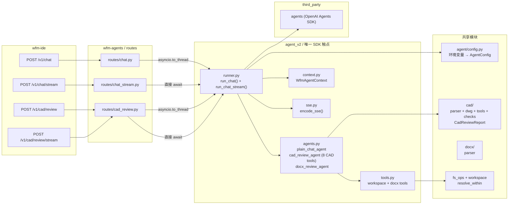

# ARCH_AGENT_SDK_NATIVE — 对话后端（OpenAI Agents SDK 原生方案）

> **版本**：v1.1（2026-05-17，同步 [ARCH_CAD_REVIEW_AGENT.md](ARCH_CAD_REVIEW_AGENT.md) 工具化重构）
> **状态**：**正式规格**，取代 `ARCH_AGENT_GATEWAY.md` / `DEV_AGENT_GATEWAY.md` 描述的 EngineAdapter + AgentGateway 抽象作为对话主链路。
> **关联**：
> - `ARCH_AGENT_GATEWAY.md`（**已废弃**，保留为历史背景）
> - `DEV_AGENT_GATEWAY.md`（**已废弃**，保留为历史背景）
> - **[ARCH_CAD_REVIEW_AGENT.md](ARCH_CAD_REVIEW_AGENT.md)**（CAD 审图工具化架构设计 v1.0 — cad_review_agent 的工具集、prompt、数据流定义）
> - `ARCH_CAD_REVIEW.md`（CAD 浏览 + 审图 v0.2，前端与字体管线不变；后端审图部分已被 ARCH_CAD_REVIEW_AGENT.md 取代）
> - `CAD_AI_SELECTION_REVIEW.md`（选区审图，L1 在本架构上落地）
> - `CAD_AI_FEASIBILITY.md`（能力边界与期望管理）
> - `ARCH_DOCX_REVIEW.md`（DOCX 审阅，同类 agent 模式）

---

## 0. 一句话

**`wfm-agents` 的所有对话流量（普通聊天、CAD 审图、DOCX 审阅）都进同一个基于 OpenAI Agents SDK（`agents` 包）的 runner。不再过 `AgentGateway → EngineRegistry → EngineAdapter` 三层抽象，也不再手写 tool loop。Agent 定义、工具注册、流式回流、结构化输出全部走 SDK 原生能力。`cad_review_agent` 拥有 8 个 `@function_tool` CAD 工具，自主决定调哪些工具、怎么分析。**

---

## 1. 为什么换

旧实现（`agent/` 包下）做的事：

- 手写 `runner.py` tool loop（`responses.create` + `function_call_output` 循环）
- `client.py` 维护 `openai.OpenAI / AsyncOpenAI` 工厂
- `session_store.py` 管理会话状态
- `recipes/` 用 `Recipe` Protocol 区分对话模式
- `tools/adapter.py` + `tools/invoke.py` 把 builtin 工具转成 SDK tool 字典
- `events.py` SSE 事件编码
- `fallback.py` 降级链

旧实现**没覆盖**或被削平成「最大公约数」的能力：

- OpenAI **Responses API** 与 **`previous_response_id` 状态托管** — 手写循环无法正确串联
- **Structured Outputs** (Pydantic ↔ JSON Schema) — 需要手动 `model_validate_json`
- **多模态** (`input_image` / `image_url`) — Recipe 抽象未预留
- **Agent handoff / guardrails / tracing** — Agents SDK 内建，手写循环全无
- **SDK 内置重试 / `max_retries` / 错误类型分类** — 需要自行实现

**判断**：在产品当前阶段（单上游 OpenAI 兼容生态 + 2 个真实场景：普通聊天与 CAD 审图），手写 runner 的 ROI 为负。切换到 OpenAI Agents SDK（`third_party/agents/openai-agents-python`）后，Agent 定义、工具注册、流式事件、多轮 tool calling 全部由 SDK 处理，`agent_v2/` 只做业务胶水。

---

## 2. 设计原则

1. **SDK 原生**：唯一持有 `agents.Runner` 的地方是 `agent_v2/runner.py`。路由层和其它模块永远不直接 import `agents`。
2. **Agent 即 Recipe**：旧 `Recipe` Protocol 由 SDK 的 `Agent(name, instructions, tools)` 替代。一个 Agent 定义 = 一组 system prompt + 工具集 + 行为参数。
3. **`@function_tool` 注册**：旧 `ToolSpec` + `adapter.py` 由 SDK 的 `@function_tool` 装饰器替代。工具函数签名即 schema，无需手动构造 JSON Schema。
4. **两个入口**：`run_chat()`（同步）和 `run_chat_stream()`（异步流式）是唯二的公开函数。所有路由都走这两个入口。
5. **前端 0 改动**：SSE 线格式（`session / text_delta / tool_call_started / tool_call_done / error / done`）与旧版一致，前端 `EventSource` 消费者无需修改。HTTP 请求/响应包络（`ChatRequest` / `ChatReply`）保持兼容。
6. **配置共享**：`agent/config.py`（环境变量加载）继续被 `agent_v2` 使用，不重复实现。
7. **GLM-5.1 兼容**：`OpenAIProvider(use_responses=False)` 走 Chat Completions API；手动 `_parse_cad_review()` 剥离 markdown code fences 后再做 schema 校验。

---

## 3. 总体架构



**核心不变量**：

- 路由层**只做**参数校验 + CAD 检测 + 调 `runner.run_chat()` / `runner.run_chat_stream()`。
- `runner.py` 是**唯一** import `agents.Runner` 的模块。
- 工具函数通过 `RunContextWrapper[WfmAgentContext]` 拿到 `workspace_root`，所有路径操作走 `resolve_within()`。

---

## 4. 模块布局

```
wfm-agents/wfm_agents/
├── agent/                         ← 旧包（已废弃，仅保留 config）
│   ├── __init__.py                # 废弃声明
│   └── config.py                  # 环境变量 → AgentConfig（被 agent_v2 使用）
│
├── agent_v2/                      ← 新对话主链路
│   ├── __init__.py                # 模块 docstring
│   ├── agents.py                  # Agent 定义：plain_chat_agent, cad_review_agent, docx_review_agent
│   ├── context.py                 # WfmAgentContext(workspace_root: str)
│   ├── tools.py                   # workspace + docx @function_tool（CAD 工具在 cad/tools.py）
│   ├── sse.py                     # SSE 事件常量 + encode_sse()
│   ├── runner.py                  # run_chat() / run_chat_stream() — 唯一入口
│   └── router.py                  # /v1/chat/v2 PoC 路由（非主链路，仅供对比测试）
│
├── routes/                        ← FastAPI 路由层
│   ├── chat.py                    # POST /v1/chat → asyncio.to_thread(run_chat, ...)
│   ├── chat_stream.py             # POST /v1/chat/stream → run_chat_stream(...)
│   └── cad_review.py              # POST /v1/cad/review + /v1/cad/review/stream
│
├── cad/                           ← CAD 业务逻辑（工具化重构后）
│   ├── __init__.py                # export
│   ├── parser.py                  # 粒度化子函数：overview / texts / dims / blocks / layer
│   ├── dwg.py                     # DWG→DXF 转换（ezdxf recover + LibreDWG CLI fallback）
│   ├── tools.py                   # 8 个 @function_tool（cad_file_read / cad_extract_* / cad_check_*）
│   ├── checks.py                  # 命名规范、标题块、标注精度等检查逻辑
│   ├── recipes.py                 # format_summary_text()（保留兼容，route 层不再调用）
│   └── review/
│       ├── __init__.py
│       └── schema.py              # CadReviewReport + render_markdown()
│
├── docx/                          ← DOCX 解析
│   ├── __init__.py
│   └── parser.py                  # python-docx 解析 → 结构化 dict
│
├── fs_ops.py                      # read_text / write_text
├── workspace.py                   # resolve_within / resolve_workspace_root
└── observability/
    └── errors.py                  # 错误码常量
```

**已删除**（不在仓库中）：

| 旧模块 | 说明 |
|--------|------|
| `agent/runner.py` | 手写 tool loop，被 `agent_v2/runner.py` 替代 |
| `agent/client.py` | OpenAI client 工厂，被 SDK `OpenAIProvider` 替代 |
| `agent/session_store.py` | 会话状态，当前不需要（无跨轮状态） |
| `agent/recipes/` | `Recipe` Protocol + 实现类，被 `Agent` 替代 |
| `agent/tools/adapter.py` | `ToolSpec → dict`，被 `@function_tool` 替代 |
| `agent/tools/invoke.py` | 工具执行路由，被 SDK 内建 tool 执行替代 |
| `agent/events.py` | SSE 编码，被 `agent_v2/sse.py` 替代 |
| `agent/fallback.py` | 降级链，当前由 `WFM_AGENT_API=chat` 配置替代 |

---

## 5. 配置（环境变量，统一前缀 `WFM_AGENT_*` / `WFM_OPENAI_*`）

环境变量由 `agent/config.py` 的 `load_config()` 统一加载，返回不可变 `AgentConfig` dataclass。

| 环境变量 | 必填 | 默认值 | 说明 |
|----------|------|--------|------|
| `WFM_OPENAI_API_KEY` | 是 | — | 也可 fallback 到 `OPENAI_API_KEY` |
| `WFM_OPENAI_BASE_URL` | 否 | `None` | DashScope / DeepSeek / GLM 等兼容层地址 |
| `WFM_AGENT_MODEL` | 否 | `gpt-4.1-mini` | 主模型；也接受 `WFM_OPENAI_MODEL` |
| `WFM_AGENT_FALLBACKS` | 否 | `""` | 逗号分隔备选模型（当前未使用） |
| `WFM_AGENT_API` | 否 | `responses` | `responses` = Responses API；`chat` = Chat Completions API |
| `WFM_AGENT_TEMP` | 否 | `0.3` | 默认温度 |
| `WFM_AGENT_TIMEOUT` | 否 | `120` | 请求超时（秒） |
| `WFM_AGENT_RETRIES` | 否 | `2` | SDK 内置 max_retries |
| `WFM_AGENT_MAX_TOOL_ROUNDS` | 否 | `8` | Runner 最大 tool calling 轮数 |
| `WFM_AGENT_SESSION_TTL_SEC` | 否 | `3600` | 会话 TTL（预留，当前无状态存储） |
| `WFM_AGENT_ALLOW_IMAGE` | 否 | `false` | 多模态总开关（预留） |

**GLM-5.1 典型配置**：

```bash
WFM_OPENAI_API_KEY=<glm-key>
WFM_OPENAI_BASE_URL=https://open.bigmodel.cn/api/paas/v4
WFM_AGENT_MODEL=glm-5.1
WFM_AGENT_API=chat          # GLM 不支持 Responses API
```

---

## 6. Agent 定义

SDK 的 `Agent` 类替代了旧的 `Recipe` Protocol。每个 Agent 封装 name、system prompt、工具列表和行为参数。

```python
from agents import Agent
from .context import WfmAgentContext
from .tools import builtin_tools, docx_tools
from ..cad.tools import cad_review_tools

plain_chat_agent: Agent[WfmAgentContext] = Agent(
    name="wfm.plain_chat",
    instructions="你是 WFM Studio 桌面工作站里的助手。回答尽量简洁、准确，默认使用中文。"
                 "如果用户的问题信息不足，直接说明你需要什么；不要臆造事实。",
    tools=builtin_tools,           # [workspace_read, workspace_write]
    tool_use_behavior="run_llm_again",
)

cad_review_agent: Agent[WfmAgentContext] = Agent(
    name="cad.review",
    instructions=(  # 详尽的 CAD 审图 system prompt，含 JSON 输出格式约束
        "你是一位资深 CAD 图纸审图工程师，专长于工业制造与船舶设计图纸。\n"
        "你有 cad_file_read / cad_extract_* / cad_check_* 等工具。\n\n"
        "审图流程：\n"
        "1. 先调 cad_file_read 获取总览\n"
        "2. 根据总览发现的问题，自主决定调哪些工具深挖\n"
        "3. 所有结论必须基于工具返回的数据，不臆造\n\n"
        "输出格式（严格 JSON，不要用 markdown 包裹）：\n"
        '{"summary":"总体评价","issues":[{"severity":"error|warning|info",'
        '"category":"分类","title":"问题标题","description":"详细描述",'
        '"suggestion":"建议","citations":[{"handle":"","layer":"","location":"","text":""}]}],'
        '"risks":["风险点"],"info_gaps":["信息缺口"]}\n\n'
        "severity 只能从 error / warning / info 三档里选。\n"
        "若信息不足以判断某点，列入 info_gaps，不要臆造。\n"
    ),
    tools=cad_review_tools,         # 8 个 CAD @function_tool
    tool_use_behavior="run_llm_again",
)

docx_review_agent: Agent[WfmAgentContext] = Agent(
    name="wfm.docx_review",
    instructions=_SYSTEM_ZH_DOCX_REVIEW,  # 金额核对 system prompt
    tools=docx_tools,                     # [workspace_read, workspace_write, docx_read]
    tool_use_behavior="run_llm_again",
)
```

**关键区别**：

| 旧 Recipe | 新 Agent |
|-----------|----------|
| `Recipe(Protocol)` + `id` / `temperature` / `response_schema` 等字段 | `Agent(name, instructions, tools)` — SDK 原生 |
| `build_system()` 返回 prompt 字符串 | `instructions` 直接是字符串 |
| `build_user_blocks()` 拼装 content blocks | Runner 层拼 prompt，Agent 不感知 |
| `response_schema: type[BaseModel]` | 不使用 SDK `output_type`（GLM 兼容），改为手动 parse |
| `tools_enabled: bool` | `tools=[...]` 传入 `@function_tool` 列表 |

> **注意**：`cad_review_agent` 的工具集定义在 `cad/tools.py`（8 个工具），详见 [ARCH_CAD_REVIEW_AGENT.md](ARCH_CAD_REVIEW_AGENT.md) §3。工具包含 Tier 1 总览（`cad_file_read`）、Tier 2 按需深挖（`cad_extract_*` / `cad_layer_inspect`）、Tier 3 专项检查（`cad_check_*`）。

---

## 7. 工具注册（`@function_tool`）

旧模式：`ToolSpec` dataclass → `adapter.py` 转 SDK tool 字典 → `invoke.py` 路由执行。

新模式：`@function_tool` 装饰器，函数签名即 schema，SDK 自动处理调用和序列化。

```python
from agents import RunContextWrapper, function_tool

@function_tool
def workspace_read(ctx: RunContextWrapper[WfmAgentContext], path: str) -> str:
    """Read a UTF-8 text file inside the workspace.

    Args:
        path: Relative path to the file within the workspace.
    """
    return read_text(ctx.context.workspace_root, path)
```

**已注册工具**：

| 工具名 | 分类 | 归属 Agent | 说明 |
|--------|------|-----------|------|
| `workspace_read` | Builtin | plain_chat | 读工作区内文本文件 |
| `workspace_write` | Builtin | plain_chat | 写工作区内文本文件 |
| `docx_read` | DOCX | docx_review | 解析 .docx 文件（段落 + 表格） |
| `cad_file_read` | CAD Tier 1 | cad_review | 读取 CAD 文件总览摘要 |
| `cad_extract_texts` | CAD Tier 2 | cad_review | 提取文字内容（TEXT + MTEXT） |
| `cad_extract_dims` | CAD Tier 2 | cad_review | 提取标注信息（DIMENSION） |
| `cad_extract_blocks` | CAD Tier 2 | cad_review | 提取块定义（BLOCK） |
| `cad_layer_inspect` | CAD Tier 2 | cad_review | 深入检查单个图层 |
| `cad_check_naming` | CAD Tier 3 | cad_review | 检查图层/块命名规范 |
| `cad_check_titleblock` | CAD Tier 3 | cad_review | 检查标题块完整性和格式 |
| `cad_check_dim_accuracy` | CAD Tier 3 | cad_review | 检查标注精度（几何 vs 文字覆盖） |

**工具集导出**：

```python
# agent_v2/tools.py 底部
builtin_tools = [workspace_read, workspace_write]
docx_tools = [workspace_read, workspace_write, docx_read]

# cad/tools.py 底部
cad_review_tools = [
    cad_file_read, cad_extract_texts, cad_extract_dims, cad_extract_blocks,
    cad_layer_inspect, cad_check_naming, cad_check_titleblock, cad_check_dim_accuracy,
]
```

- `plain_chat_agent` 使用 `builtin_tools`（2 个工具）。
- `cad_review_agent` 使用 `cad_review_tools`（8 个 CAD 审图工具）。
- `docx_review_agent` 使用 `docx_tools`（3 个工具）。

> CAD 工具的完整定义、参数、返回格式见 [ARCH_CAD_REVIEW_AGENT.md](ARCH_CAD_REVIEW_AGENT.md) §3。DWG 文件后端处理见同文档 §4。

**安全模型**：所有工具通过 `ctx.context.workspace_root` 获取工作区根，文件路径一律 `resolve_within()` 校验，与旧版一致。

---

## 8. Runner 核心逻辑

`agent_v2/runner.py` 是整个对话后端的唯一入口。路由层只调两个函数。

### 8.1 同步入口 `run_chat()`

```python
def run_chat(
    *,
    message: str,
    workspace_root: str,
    session_id: str | None = None,
    cad_file_path: str | None = None,
    docx_extras: dict[str, Any] | None = None,
) -> ChatResult:
```

执行流程：

1. `load_config()` → 构建 `RunConfig`（含 `OpenAIProvider`、`ModelSettings`）。
2. 构造 `WfmAgentContext(workspace_root=...)`。
3. 根据 `cad_file_path` / `docx_extras` 选择 Agent：
   - `cad_file_path is not None` → `cad_review_agent`，prompt 为 `"请审图，文件路径: {path}\n用户要求: {message}"`（不解析文件、不拼摘要，全交给 agent 调工具）。
   - `docx_extras is not None` → `docx_review_agent`，prompt 由 `_build_docx_prompt()` 拼装。
   - 否则 → `plain_chat_agent`，prompt 直接是用户消息。
4. 调 `Runner.run_sync(starting_agent=..., input=prompt, context=ctx, run_config=..., max_turns=...)`。
5. 对 CAD 审图结果调 `_parse_cad_review()` 剥离 code fences 并校验 schema。
6. 返回 `ChatResult` dataclass。

> **重要变更**：CAD 审图不再在 runner 层做 DXF 摘要。runner 只传文件路径给 agent，由 agent 通过 8 个 `@function_tool` 自主调取数据。详见 [ARCH_CAD_REVIEW_AGENT.md](ARCH_CAD_REVIEW_AGENT.md) §5–§6。

### 8.2 流式入口 `run_chat_stream()`

```python
async def run_chat_stream(
    *,
    message: str,
    workspace_root: str,
    session_id: str | None = None,
    cad_file_path: str | None = None,
    docx_extras: dict[str, Any] | None = None,
) -> AsyncIterator[bytes]:
```

执行流程：

1. 同样的 config / context / agent 选择逻辑。
2. 先 yield `session` 事件（`encode_sse({"type": "session", "session_id": ...})`）。
3. 调 `Runner.run_streamed(...)` 获取 `StreamingAgentRunner`。
4. 遍历 `streamed.stream_events()`，映射 SDK 事件到 SSE 事件（见 §9）。
5. 流结束后 yield `done` 事件。
6. 异常时 yield `error` 事件。

### 8.3 GLM-5.1 JSON 解析

```python
_FENCE_RE = re.compile(r"```(?:json)?\s*\n?(.*?)\n?\s*```", re.DOTALL)

def _parse_cad_review(text: str) -> tuple[str, dict | None]:
    m = _FENCE_RE.search(text)
    json_str = m.group(1).strip() if m else text.strip()
    data = json.loads(json_str)
    report = CadReviewReport.model_validate(data)
    return render_markdown(report), report.model_dump()
```

GLM-5.1 即使被要求输出纯 JSON 也会包裹 markdown code fences。`_parse_cad_review()` 先正则剥离，再做 schema 校验。校验失败时返回原始文本（降级为 Markdown 展示）。

### 8.4 Provider 构建

```python
def _build_run_config() -> tuple[RunConfig, int]:
    cfg = load_config()
    provider = OpenAIProvider(
        api_key=cfg.api_key,
        base_url=cfg.base_url,
        use_responses=cfg.use_responses_api,  # GLM → False
    )
    return RunConfig(
        model=cfg.model,
        model_provider=provider,
        model_settings=ModelSettings(temperature=cfg.temperature),
    ), cfg.max_tool_rounds
```

- `use_responses=False` 时 SDK 走 Chat Completions API（`/chat/completions`）。
- `use_responses=True` 时 SDK 走 Responses API（`/responses`）。

---

## 9. SSE 流式事件映射

### 9.1 事件常量（`sse.py`）

```python
EVENT_SESSION           = "session"
EVENT_TEXT_DELTA        = "text_delta"
EVENT_TOOL_CALL_STARTED = "tool_call_started"
EVENT_TOOL_CALL_DONE    = "tool_call_done"
EVENT_ERROR             = "error"
EVENT_DONE              = "done"
```

### 9.2 SDK 事件 → SSE 事件映射

| SDK 事件 (`stream_events()`) | SSE 事件 | 载荷 |
|-------------------------------|----------|------|
| `run_item_stream_event` + `name="message_output_created"` | `text_delta` | `{"type":"text_delta","delta":"<text>"}` |
| `run_item_stream_event` + `name="tool_called"` | `tool_call_started` | `{"type":"tool_call_started","id":"...","name":"..."}` |
| `run_item_stream_event` + `name="tool_output"` | `tool_call_done` | `{"type":"tool_call_done","id":"..."}` |
| 流结束 | `done` | `{"type":"done","session_id":"...","trace_id":null,"text":"..."}` |
| 异常 | `error` | `{"type":"error","error":"..."}` |
| 流开始 | `session` | `{"type":"session","session_id":"..."}` |

### 9.3 线格式

```
data: {"type":"session","session_id":"abc-123"}\n\n
data: {"type":"text_delta","delta":"你好"}\n\n
data: {"type":"tool_call_started","id":"call_1","name":"workspace_read"}\n\n
data: {"type":"tool_call_done","id":"call_1"}\n\n
data: {"type":"done","session_id":"abc-123","trace_id":null,"text":"完整回复"}\n\n
```

与旧版 `events.py` 输出格式完全一致，前端 `EventSource` 消费者无需改动。

---

## 10. HTTP 包络（ChatRequest / ChatReply 兼容性）

### 10.1 路由 → Runner 映射

| HTTP 路由 | 方法 | 调用方式 | 说明 |
|-----------|------|----------|------|
| `/v1/chat` | POST | `asyncio.to_thread(run_chat, ...)` | 同步，返回 JSON |
| `/v1/chat/stream` | POST | `run_chat_stream(...)` | SSE 流式 |
| `/v1/cad/review` | POST | `asyncio.to_thread(run_chat, ..., cad_file_path=...)` | 同步审图 |
| `/v1/cad/review/stream` | POST | `run_chat_stream(..., cad_file_path=...)` | SSE 流式审图 |

### 10.2 ChatRequest（与旧版兼容）

```python
class ChatRequest(BaseModel):
    workspace_root: str                          # 必填
    message: str                                 # 必填
    session_id: str | None = None                # 日志关联
    recipe: Literal["plain_chat","cad_review",...] | None = None
    language: Literal["zh-CN","en"] | None = None
    extras: dict | None = None
    # CAD 文件引用（支持 .dwg 和 .dxf）
    dxf_text: str | None = None                  # inline DXF（来自 viewer）
    cad_source_uri: str | None = None            # CAD 文件 URI（右键菜单 / 消息提取）
    dxf_source_uri: str | None = None            # 向后兼容，等同 cad_source_uri
    # DOCX 文件引用
    docx_path: str | None = None                 # 工作区内 .docx 文件相对路径
    # 兼容旧字段
    mode: ChatMode | None = None                 # 忽略 + deprecation warn
    engine: EngineId | None = None               # 忽略 + deprecation warn
```

**CAD 检测逻辑**（route 层 `_resolve_cad_file_ref()`，详见 [ARCH_CAD_REVIEW_AGENT.md](ARCH_CAD_REVIEW_AGENT.md) §6.2）：

1. `dxf_text` 存在 → 写临时 .dxf 文件 → `cad_file_path = tmp_path`
2. `cad_source_uri` 存在 → resolve 为文件系统路径 → `cad_file_path`
3. `message` 中包含工作区内 `.dxf` / `.dwg` 路径 → resolve → `cad_file_path`
4. 都没命中 → `cad_file_path = None`（普通聊天或 DOCX 审阅）

### 10.3 ChatReply（与旧版一致）

```python
class ChatReply(BaseModel):
    role: str = "assistant"
    content: str
    workspace_root: str
    received_at: str
    trace_id: str | None = None
    session_id: str | None = None
```

新增 `session_id` 字段（可选），老前端不传不收不受影响。

### 10.4 旧字段处理

- `engine` — 接受但忽略，打 `deprecation warning`。
- `mode`（非 `echo`）— 接受但忽略，打 `deprecation warning`。
- `WFM_DEFAULT_ENGINE` / `WFM_CHAT_MODE` — 启动时不再报错，但 agent_v2 路径下不读取。

---

## 11. GLM-5.1 兼容性说明

GLM-5.1（智谱 BigModel）通过 OpenAI 兼容层接入，有以下特殊处理：

| 问题 | 解决方案 |
|------|----------|
| 不支持 Responses API | `WFM_AGENT_API=chat` → `OpenAIProvider(use_responses=False)` → SDK 走 `/chat/completions` |
| JSON 输出包裹 markdown code fences | `_parse_cad_review()` 正则剥离 `` ```json ... ``` `` 后再 `json.loads()` |
| 不支持 `output_type` 结构化输出 | 不使用 SDK `output_type`，改为手动 `CadReviewReport.model_validate()` |
| 工具调用兼容性 | SDK `use_responses=False` 时自动使用 Chat Completions 的 `tools` 参数 |

---

## 12. 与旧文档的关系

| 文档 | 状态 | 与本文的关系 |
|------|------|-------------|
| `ARCH_AGENT_GATEWAY.md` | **已废弃** | 顶部已有 DEPRECATED 横幅，链到本文档 |
| `DEV_AGENT_GATEWAY.md` | **已废弃** | 顶部已有 DEPRECATED 横幅，链到本文档 |
| **[ARCH_CAD_REVIEW_AGENT.md](ARCH_CAD_REVIEW_AGENT.md)** | **现行（v1.0）** | CAD 审图工具化架构设计。定义 `cad_review_agent` 的 8 个工具、prompt、DWG 处理、route 层改造。本文 §6–§8 中 CAD 相关内容以其为准 |
| `ARCH_CAD_REVIEW.md` | **部分现行** | 前端 viewer / 字体管线不变；§3（后端 DXF 摘要管线）和审图链路已被 ARCH_CAD_REVIEW_AGENT.md 取代 |
| `ARCH_DOCX_REVIEW.md` | **现行** | DOCX 审阅规格，与 CAD 审图同类模式 |
| `CAD_AI_SELECTION_REVIEW.md` | **现行** | 选区审图，Phase 2 扩展方向 |
| `CAD_AI_FEASIBILITY.md` | **现行** | 能力评估与多模态结论沿用；§6 工具底座已在 ARCH_CAD_REVIEW_AGENT.md 中落地 |

---

## 13. 不在本期范围

- **多 Agent handoff**：SDK 支持 Agent 间切换，当前只有两个独立 Agent，不需要 handoff。
- **Session 持久化**：`WFM_AGENT_SESSION_TTL_SEC` 已在 config 中预留，但无实际状态存储。跨轮记忆由前端在 `message` 中传入。
- **第二个 provider 抽象**：出现 Anthropic / Gemini 等非 OpenAI 系需求时再看。
- **MCP 工具集成**：当前只有 `@function_tool` 注册的 builtin 工具。MCP 聚合待后续引入。
- **多模态截图**：`WFM_AGENT_ALLOW_IMAGE` 已预留，当前未接入图像输入。
- **下线 `agent_v2/router.py`**：`/v1/chat/v2` PoC 路由仅供 A/B 对比测试，稳定后删除。
- **下线 `engines/` 与 `gateway/`**：旧目录保留但不被对话路径调用，等全面稳定后单独一期清理。
