# ARCH_CAD_REVIEW — CAD 浏览与审图

> **版本**：v0.2（2026-05-09）；**字体管线**：同日起 vendor `cad-data/fonts` + `fonts.json` alias + eventBus 上报（见 §4.6）
> **关联**：[USAGE_CAD_VIEWER.md](USAGE_CAD_VIEWER.md)（用户操作指南）、[PRD.md](PRD.md)、[TASK_SCENARIOS.md](TASK_SCENARIOS.md)、[UPSTREAM_PATCHES.md](UPSTREAM_PATCHES.md)、[ARCH_AGENT_GATEWAY.md](ARCH_AGENT_GATEWAY.md)
> **变更**：v0.1 走"后端 spawn ODAFileConverter + 前端文本预览"路线，已被实测证伪（macOS 上 ODA 在 headless 子进程里 NSXPC bootstrap 失败、SIGABRT）。v0.2 改走"前端 in-browser 渲染（cad-viewer + libredwg-web）+ 后端 ezdxf 摘要"路线，**彻底移除后端的 DWG→DXF 转换链路**，并把中央编辑区从「文本预览」升级为**真 CAD viewer**（pan/zoom/选择/图层显隐/Hatch GPU 渲染）。

---

## 1. 目标与范围

打通"在 WFM Studio 里**看 + 审一张 CAD 图**"的端到端流程：

1. 用户把 `.dwg` 或 `.dxf` 放进工作目录
2. 双击文件 → 中央编辑区直接渲染为可交互 CAD 视图（pan/zoom/图层切换/选实体）
3. 在 viewer 工具栏点「AI 审图」，或在右侧"任务对话"里用一句自然语言（含该文件的相对路径）触发 AI 审图，得到结构化审图意见

**v0.2 新增**：
- **真渲染**：WebGL/Three.js viewer，60FPS，支持图层管理、Hatch、Paper space
- **DWG 直读**：浏览器内 LibreDWG WASM 直接解析 .dwg，零后端依赖
- **viewer ↔ 审图联动**：viewer 工具栏「AI 审图」按钮直接把 in-browser 解析得到的 DXF 文本 POST 到 `/v1/chat`
- **离线字体**：vendor mlightcad [`cad-data`](https://gitlab.com/mlightcad/cad-data) 全量字体目录（SHX + mesh WOFF + 少量 TTF），不访问外网 CDN；设计院常用名称在 `fonts.json` 做 alias（详见 §4.6）

**不在 v0.2 范围**：

- 视觉 LLM（截图喂多模态模型）
- viewer 高亮联动审图 issue（issue 行号/坐标 ↔ 实体闪烁）
- 多文件批量审图、规范库、issue 持久化
- viewer 内编辑（cad-viewer roadmap 已有 editor 能力，本期只用 viewer 模式）

---

## 2. 数据流

```mermaid
flowchart LR
    user["用户双击 .dwg/.dxf"]
    explorer["wfm-ide Explorer"]
    pane["CadViewerEditor (EditorPane)"]
    webview["webview 内嵌 cad-viewer<br/>+ libredwg-web WASM"]
    btn["viewer 工具栏 'AI 审图' 按钮"]
    ipc["webview ↔ main IPC<br/>(postMessage + ChannelClient)"]
    chat["右侧任务对话面板"]
    api["POST /v1/chat<br/>(可选附带 dxf_text)"]
    detect["routes/chat.py 检测<br/>dxf_text 优先 / 回退磁盘 .dxf"]
    parser["cad.parser.summarize_dxf<br/>(ezdxf)"]
    recipe["cad.recipes.cad_review_prompt"]
    engine["engine: echo / single / anthropic"]
    reply["assistant 回复 → 任务对话"]

    user --> explorer --> pane --> webview
    webview -->|in-browser 解析<br/>+ 渲染| webview
    webview --> btn --> ipc --> chat --> api
    chat -->|或：用户直接打字<br/>'审一下 xxx.dxf'| api
    api --> detect --> parser --> recipe --> engine --> reply
```



两条**并存**的审图触发路径：

- **viewer 触发**：用户点工具栏按钮，`dxf_text` 通过 IPC 直接附到 chat 请求里。**不要求磁盘上有同名 .dxf**（用户拖的可能就是 .dwg）
- **聊天触发**：用户在任务对话里说"审一下 xxx.dxf"，后端走 v0.1 已有的磁盘 lookup 分支（保持向后兼容）

---

## 3. 后端（wfm-agents）

### 3.1 模块清单

| 文件 | 职责 | 变更 |
|------|------|------|
| ~~`wfm_agents/cad/converter.py`~~ | ~~spawn ODAFileConverter~~ | **整个文件删除**（v0.2） |
| `wfm_agents/cad/parser.py` | 用 `ezdxf` 抽取 layers / 实体计数 / TEXT / DIMENSION / blocks | 保留 |
| `wfm_agents/cad/recipes.py` | 把摘要 + 用户问题拼成审图 prompt | 保留 |
| `wfm_agents/cad/__init__.py` | export | **删除 ODA 三个 symbol 的 import / export** |
| ~~`wfm_agents/routes/cad.py`~~ | ~~`POST /v1/cad/convert`~~ | **整个文件删除**（v0.2） |
| `wfm_agents/server.py` | router 注册 | **删 `app.include_router(cad.router)` 与 `from .routes import cad`** |
| `wfm_agents/routes/chat.py` | 检测 .dxf 引用并切 cad review 分支 | **扩展 ChatRequest schema：可选 `dxf_text: str`，存在时跳过磁盘 lookup** |

解析器 `parser.py`（保持 v0.1 不变）的硬上限：texts ≤ 200、dimensions ≤ 200、layers 详情 ≤ 200、blocks ≤ 200（在 `parser._MAX_*` 常量）。

### 3.2 `/v1/chat` schema 扩展

```python
class ChatRequest(BaseModel):
    workspace_root: str
    message: str
    engine: Literal["echo", "single", "anthropic", "crewai", "maf", "agenticx"] = "echo"
    mode: Literal["echo", "review"] = "echo"
    # v0.2 新增（可选）：前端 viewer 直接附带的 DXF 文本
    # 存在时优先于消息里 .dxf token + 磁盘 lookup；workspace_root 仍要传（用于审计）
    dxf_text: str | None = Field(None, description="In-browser 解析得到的 DXF 文本；优先于磁盘 lookup")
```

`chat.py` 处理顺序：

1. 若 `req.dxf_text` 非空 → 直接 `ezdxf.read(io.StringIO(req.dxf_text))` → `summarize_dxf` → `cad_review_prompt`，跳过 `_extract_dxf_candidates` / `_resolve_dxf_in_workspace`
2. 否则（向后兼容 v0.1 链路）→ 走 `_try_build_cad_review_turn` → 消息文本里 `xxx.dxf` token → `resolve_within(workspace_root, token)` → 磁盘文件 → 解析
3. 都没命中 → 退回普通 `turn_request_from_chat`

`client_meta` 字段相应新增：`wfm_cad_dxf_source ∈ {"viewer_inline", "workspace_file"}`，便于审计日志区分来源。

### 3.3 错误码（v0.2 收敛）

v0.1 的 503/500（ODA 未配置 / 转换失败）整组下线。`/v1/chat` 在 .dxf 来源失败时的错误：

| 状态 | 触发 |
|------|------|
| 400 | `workspace_root` 不是绝对路径 / 路径越界 / `dxf_text` 为空字符串但字段存在 |
| 422 | `ezdxf` 解析失败（少数特殊实体类型）|
| 200 | 即便 .dxf 解析成功但摘要为空，也回退普通 echo（有 `client_meta.wfm_chat_mode` 标识）|

### 3.4 测试调整

`wfm-agents/tests/test_cad.py`：

- ❌ 删 `TestConverterContract`（整个 class，依赖 `dwg_to_dxf`）
- ❌ 删 `TestCadConvertRoute`（整个 class，依赖 `/v1/cad/convert`）
- ❌ 删顶部 `from wfm_agents.cad.converter import ODA_PATH_ENV, find_oda_converter`
- ✅ 保留 `TestParserAndRecipe`、`TestChatExtraction`、`TestChatRouting`
- 🆕 新增 `TestChatInlineDxfText`：构造 `dxf_text` 字段直接 POST `/v1/chat`，断言摘要进入 echo 回复

---

## 4. 前端（wfm-ide）

按 [`.cursor/rules/wfm-ide-fork-policy.mdc`](../.cursor/rules/wfm-ide-fork-policy.mdc)，全部新代码在 `contrib/wfm/cadReview/` 内：

```
wfm-ide/src/vs/workbench/contrib/wfm/cadReview/
├── browser/
│   ├── cadReview.contribution.ts        EditorPane 注册 + .dwg/.dxf 编辑器关联
│   ├── cadViewerEditor.ts               EditorPane（内联 HTML：CSP、`__WFM_CAD__` bootstrap）
│   ├── cadViewerEditorInput.ts          EditorInput
│   ├── cadViewerMessages.ts             webview ↔ main IPC 消息类型
│   └── media/
│       ├── viewer.js                    AcApDocManager 初始化、IPC、OrbitControls、字体事件
│       ├── viewer.css                   样式
│       ├── cad-viewer.iife.js           esbuild IIFE（cad-simple-viewer + data-model + …，~4.8 MB）
│       ├── libredwg-web.wasm            LibreDWG WASM（~6 MB，GPL-3.0）
│       ├── *-parser-worker.js           DXF/DWG 解析 worker（vendor）
│       ├── mtext-renderer-worker.js     MTEXT 渲染 worker（vendor）
│       └── fonts/                       cad-data 镜像：`fonts.json` + ~87 个字体文件（~29 MB）
└── common/
    └── cadReview.ts                     CAD_VIEWER_EDITOR_ID 等常量
```

### 4.1 编辑器关联

通过 `IEditorResolverService.registerEditor` 把 **`*.dxf` 和 `*.dwg`** （限 `file://` / `vscode-remote://`）关联到 `CadViewerEditor`，`priority: RegisteredEditorPriority.builtin`，避免被内置 `BinaryFileEditor` 抢走默认打开方式（用户仍可 **Reopen With…** 选文本编辑器看 .dxf 原文）。

```typescript
editorResolverService.registerEditor(
    `*.{dwg,dxf}`,                       // 双扩展名 glob
    { id: CAD_VIEWER_EDITOR_ID, label: 'WFM CAD 预览', priority: RegisteredEditorPriority.builtin },
    {
        singlePerResource: true,
        canSupportResource: r =>
            (r.scheme === Schemas.file || r.scheme === Schemas.vscodeRemote)
            && (extname(r) === '.dwg' || extname(r) === '.dxf'),
    },
    { createEditorInput: ({ resource }) => ({ editor: instantiationService.createInstance(CadViewerEditorInput, resource) }) },
);
```

### 4.2 删除的命令与菜单

v0.1 的 `wfm.cad.convertToDxf` Action2 + Explorer 右键 "转为 DXF 并预览" 菜单项 + `IWfmAgentClientService.convertDwgToDxf()` 接口与实现整组下线。`wfmAgentClient.ts` 的 `IWfmCadConvertResult` interface 同步删除。

### 4.3 CadViewerEditor（webview-based）

`CadViewerEditor extends EditorPane`，关键步骤：

1. `createEditor()` 用 `IWebviewService.createWebviewElement({ ... extension: undefined, options: { allowScripts: true, retainContextWhenHidden: true } })` 创建 webview
2. `setInput()`：
   - 用 `IFileService.readFile(resource)` 读完整二进制（DXF 也直接读全量；libredwg-web/cad-viewer 自身管内存）
   - 经 `webview.postMessage` 把 `{ kind: 'load', uri: resource.toString(), bytes: Uint8Array }` 送进 webview
3. webview 内 `viewer.js` 收到 `load` 消息：走 `AcApDocManager.openDocument` / `database.read`（详见 `viewer.js`，含 DWG 静默失败时的兜底路径）；缓存 DXF 文本供「AI 审图」
4. viewer 工具栏「AI 审图」→ `vscode.postMessage({ kind: 'reviewRequest', dxfText, sourceUri, fileName, ... })`
5. `CadViewerEditor` 收到 `reviewRequest` → `IWfmAgentClientService.chat(..., { dxfText })`，转发到右侧任务对话 ViewModel

HTML 由 `cadViewerEditor.ts` 的 `buildViewerHtml()` **内联生成**（非独立 `viewer.html`）。`window.__WFM_CAD__` 注入 `mediaBase`（**必须以 `/` 结尾**）、worker URL、`cad-viewer.iife.js` 与 `viewer.js` 的 script 顺序等。CSP 须含 `wasm-unsafe-eval`、`'unsafe-eval' blob:`（worker blob）、以及 webview 资源域下的 `font-src` / `connect-src`。

### 4.4 Webview ↔ main IPC

`cadViewerMessages.ts` 定义双向消息类型：

```typescript
// main → webview
type LoadMessage = { kind: 'load'; uri: string; bytes: Uint8Array };
type ThemeMessage = { kind: 'theme'; isDark: boolean };

// webview → main
type ReviewRequestMessage = { kind: 'reviewRequest'; dxfText: string; sourceUri: string };
type ReadyMessage = { kind: 'ready' };
type ErrorMessage = { kind: 'error'; message: string };
type LayerStatsMessage = { kind: 'layerStats'; counts: Record<string, number> };  // 可选：图层统计
type MissingDataMessage = {
  kind: 'missingData';
  missingFontNames: string[];   // eventBus fonts-not-found / fonts-not-loaded 累积
  missingImageCount: number;   // view.missedData.images
};
```

main 端 `handleMissingData`：`INotificationService.notify({ severity: Warning, sticky: true })`，文案说明「未识别字体 → 可能仍在 fallback」，并指引扩展 `media/fonts/fonts.json`。

### 4.5 客户端服务扩展（精简版）

`wfm/common/wfmAgentClient.ts` 与 `wfm/browser/wfmAgentClientService.ts`：

- 删 `IWfmCadConvertResult` / `convertDwgToDxf` / `IRawCadConvertReply`
- `chat(message, options?)` 增加可选 `options.dxfText: string`，POST body 多带一个 `dxf_text` 字段（与后端 schema 对应）

### 4.6 字体管线（SHX / mesh / TTF，离线）

设计与 upstream [cad-data/fonts.json](https://mlightcad.gitlab.io/cad-data/fonts/fonts.json) 对齐：`cad-simple-viewer` 的 `AcApDocManager` 接收选项 `baseUrl`（**资源父目录**，对应 webview 内的 `media/` URI），内部执行 **`fontLoader.baseUrl = baseUrl + 'fonts/'`**（见 `@mlightcad/cad-simple-viewer` `AcApDocManager`），随后 `fetch(fontLoader.baseUrl + 'fonts.json')` 并按需加载清单中的 `.shx` / `.woff` / `.ttf`。

WFM Studio 约定：

| 项 | 说明 |
|---|---|
| **Vendor** | `media/fonts/` 镜像 GitLab [`mlightcad/cad-data`](https://gitlab.com/mlightcad/cad-data) 的 `fonts/`（含官方 `fonts.json` + 字体二进制），提交进仓库，**不**在运行时访问 `mlightcad.gitlab.io`。 |
| **`baseUrl` / `mediaBase`** | `cadViewerEditor.ensureWebview()` 把 `asWebviewUri(MEDIA_ROOT)` 转成字符串并**强制末尾 `/`**，再写入 `__WFM_CAD__.mediaBase`，避免拼接成 `.../mediafonts/`。 |
| **默认字体** | `viewer.js` **不设** `notLoadDefaultFonts: true`，以便主线程与 `mtext-renderer-worker` 走完整加载链；worker 内通过 `setFontUrl` 与主线程 `baseUrl` 对齐。 |
| **别名** | 设计院图纸常见名（如 `swissl`、`hzdx`、`hzfs`…）在本地 `fonts.json` 里并入现有 mesh 条目的 `name` 数组，映射到 `arial.woff` / `simhei.woff` 等。 |
| **缺失检测** | `build/cad-viewer-entry.mjs` 将 `eventBus` 挂到 `window.WfmCadBootstrap`；`viewer.js` 在 `createInstance` 之前 `eventBus.on('fonts-not-found' | 'fonts-not-loaded', …)`，向 Set 累积失败字体名；`loadDocument` 开头 `clear()`；文档就绪后 `setTimeout(reportMissingData, …)` 通过 IPC `missingData` 上报。扫 `textStyleTable` 的旧逻辑已弃用（会把已 alias 的样式误判为缺失）。 |

用户可读说明见 [USAGE_CAD_VIEWER.md — §5 字体支持](USAGE_CAD_VIEWER.md#5-字体支持)。

---

## 5. 部署与配置

### 5.1 后端依赖

`pyproject.toml`：

- 保留 `ezdxf>=1.3`
- ~~删除 ODA 相关说明~~（converter.py 删后 ezdxf 是唯一 CAD 解析依赖）

安装：

```bash
cd wfm-agents
uv sync --extra dev
```

### 5.2 前端依赖

`wfm-ide/package.json` 新增（开发期），但 vendor 后**实际打包 bundle 走 `media/`**，避免污染 vscode 的依赖图：

```bash
cd wfm-ide
npm install --save-dev @mlightcad/cad-simple-viewer @mlightcad/libredwg-web …
# 或者直接 vendor：从 npm 拉 dist/ 后拷到 contrib/wfm/cadReview/browser/media/
```

vendor 产物加入 git tracking：`cad-viewer.iife.js`（约 **4.8 MB**）、`libredwg-web.wasm`（约 **6 MB**）、若干 worker，外加 **`media/fonts/` 约 29 MB**。首次打开 CAD webview 会拉齐上述资源；`retainContextWhenHidden=true` 后切回同一 pane 一般不重复初始化。

### 5.3 第三方组件 license 登记

| 组件 | 版本 | License | 来源 |
|---|---|---|---|
| `@mlightcad/cad-simple-viewer` | ^1.x（约） | MIT | [GitHub](https://github.com/mlightcad/cad-simple-viewer) |
| `@mlightcad/libredwg-web` | ^0.7 | **GPL-3.0** | [GitHub](https://github.com/mlightcad/libredwg-web) |
| `cad-data`（字体 bundle） | （随仓库） | 见上游仓库声明 | [GitLab](https://gitlab.com/mlightcad/cad-data) |
| `LibreDWG`（上游 C 库） | latest | GPL-3.0+ | [GitHub](https://github.com/LibreDWG/libredwg) |
| `three` | ^0.182 | MIT | （cad-viewer 传递依赖） |
| `ezdxf` | ^1.3 | MIT | （后端 Python） |

GPL-3.0 viral 不构成本项目选型障碍 —— 见 [`.cursor/rules/project-license.mdc`](../.cursor/rules/project-license.mdc)（本项目完全开源公开，整体可作 GPL-3 兼容协议发布）。

### 5.4 启动后端

```bash
cd wfm-agents
uv run uvicorn wfm_agents.server:app --reload --host 127.0.0.1 --port 8765
```

或一键：`./scripts/dev-minimal.sh`。

`WFM_ODA_CONVERTER_PATH` / `WFM_ODA_OUTPUT_VERSION` 环境变量在 v0.2 后**不再使用**，文档与脚本不再 export。

---

## 6. 本地验证 checklist

1. `cd wfm-agents && uv sync --extra dev` 拉到 `ezdxf`
2. `cd wfm-ide && npm run watch`，等 `Finished compilation`
3. 启动后端：`./scripts/dev-minimal.sh` 或手动 `uv run uvicorn ...`
4. `./scripts/code.sh /path/to/test-folder` 打开含 `.dwg` / `.dxf` 的目录
5. 双击任意 `.dwg` 或 `.dxf` → 中央编辑区出现 cad-viewer，可 pan/zoom/选实体/切图层
6. 点 viewer 工具栏「AI 审图」→ 右侧任务对话出现回复（echo 模式可见完整 prompt + 摘要）
7. 也可在任务对话直接输入：`审一下 <相对路径>.dxf`（旧路径，验证向后兼容）
8. **字体离线**：DevTools Network 中不应出现对 `mlightcad.gitlab.io` 的字体请求；打开含中英文 SHX 的图纸，文字可见且无误导性的 SHX「完全不支持」类告警（仅在 genuinely unknown 字体时出现 fallback toast）
- 后端：看 `.wfm-dev/logs/agents.log` 的 `POST /v1/chat`
- 前端 webview：在 IDE 里 `Help → Toggle Developer Tools → Console`，搜 `[wfm-cad-viewer]` 前缀

---

## 7. 已知风险与限制

- **LibreDWG bug**：少数 .dwg（特别是 AutoCAD 2025+ 极新格式 / 特殊行业插件生成的私有对象）可能打不开或缺实体。回退方案：让用户用任意 CAD 软件（AutoCAD / DraftSight / 中望 / ODA File Converter GUI）导出为 .dxf 后再丢进来
- **天正建筑等中国建筑行业 CAD 插件**：天正自定义实体 LibreDWG 不识别，建筑设计院图纸需先在天正软件里"另存为 T3"。**对船舶设计 / 工业制造场景无影响**
- **DWG `TABLE` 实体**：LibreDWG 上游不支持，用线条画的"伪表格"正常显示
- **External References (XRefs)**：cad-viewer / libredwg-web 不支持，xref 内容显示为空
- **文字与字体**：主路径已 vendor SHX + mesh 字体并启用默认加载链；仍可能有图纸引用不在 `fonts.json` 中的字体名 → 走内置 fallback，右下角 `missingData` toast 列出事件总线上报的字体。复杂 MTEXT 格式符、极端编码组合仍可能与桌面 CAD 有视觉差异；送 LLM 的 ezdxf 摘要不依赖 WebGL 字体
- **bundle / 字体体积**：IIFE + WASM + worker + `fonts/` 合计约 **40 MB 量级**（字体 ~29 MB），首次打开 webview 耗时取决于磁盘与 IPC；`retainContextWhenHidden=true` 后切换 pane 一般不重复完整加载
- **ezdxf 异常**：少数特殊实体类型可能让 `ezdxf.read()` 失败，对应 `/v1/chat` 返回 422
- **prompt 长度**：摘要按硬上限截断；极图层 / 极文字图纸的摘要仍可能 >10K tokens；上下文超限时再做"按图层分块审图"

---

## 8. 后续计划（Phase 3 候选）

**设计摘要（选区审图 / 截图多模态 / Issue 反标）**：见 [CAD_AI_SELECTION_REVIEW.md](CAD_AI_SELECTION_REVIEW.md)。

- [ ] viewer ←→ 审图意见联动高亮（issue 行号 / 实体 handle 双向跳转）
- [ ] 多模态视觉补充（cad-viewer 离屏 canvas → PNG 截图喂 GPT-4V / Claude 视觉）
- [ ] 审图规则库（专业图集与规范条文 RAG，如船级社规范、ABS / DNV 检验要点）
- [ ] 批量审图（文件夹一键审完出报表）
- [ ] issue 持久化到工作区 `.wfm/cad-review/` JSON
- [ ] 启用 cad-viewer **editor 模式**：用户在 IDE 内直接画图、改图、保存 .dxf
- [ ] 自定义实体支持框架（为未来船舶专业插件留口）
