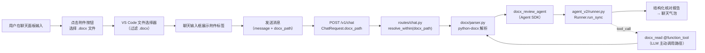

# ARCH_DOCX_REVIEW — Word 文档解析与审阅

> **版本**：v0.2（2026-05-14）；**状态**：规格（实现前）
> **分支**：`feat/docx-review`
> **关联**：[ARCH_AGENT_SDK_NATIVE.md](ARCH_AGENT_SDK_NATIVE.md)（对话后端正式规格）、[ARCH_CAD_REVIEW.md](ARCH_CAD_REVIEW.md)（CAD 审图，同类模式参考）、[TASK_SCENARIOS.md](TASK_SCENARIOS.md)、[PLAN.md](PLAN.md) Phase 7
> **原则**：若本文与 ARCH_AGENT_SDK_NATIVE 冲突，以 ARCH_AGENT_SDK_NATIVE 为准。
> **变更**：v0.1 基于 Recipe/ToolProvider 模式设计；后端已迁移至 OpenAI Agents SDK（`agent_v2/`），v0.2 重写为 Agent + `@function_tool` 模式。

---

## 1. 目标与范围

在 WFM Studio 聊天面板中支持 **Word 文档（.docx）的附加与智能审阅**：

1. 用户在聊天面板附加一份 .docx 文件（如投标文件、标书）
2. 输入自然语言提问（如"核对文件中的所有金额"）
3. 后端解析文档、提取结构化内容，由 LLM 分析后返回结构化结果

**首期场景**（金额核对）：

- 提取文档中所有表格的数值数据
- 逐行验证：数量 × 单价 = 合价
- 逐表验证：小计 = 各行合价之和
- 全局验证：总计 = 各表小计之和
- 输出带 ✅/⚠️/❌ 标记的结构化核对报告

**在 v0.1 范围内**：

- .docx 文件的解析与结构化提取（段落 + 表格）
- 金额核对场景（Agent + Prompt）
- 聊天面板附件按钮（前端）
- `docx_read` 工具（LLM 可通过 `@function_tool` 调用）

**不在 v0.1 范围**：

- .doc（旧二进制格式）支持
- 图片/嵌入式对象（OLE、Chart）的提取
- 文档内容修改/回写
- 批量文档处理
- PDF 文件支持

---

## 2. 数据流



两条**并存**的触发路径：

- **附件触发**：用户通过附件按钮选择 .docx，`docx_path` 附到 ChatRequest，后端解析文档内容后进入 `docx_review_agent`
- **工具触发**：LLM 在 `plain_chat_agent` 模式下通过 `docx_read` 工具主动读取文档（用户在消息中提到 .docx 文件路径时）

---

## 3. 后端（wfm-agents）

### 3.1 新增依赖

```
python-docx>=1.1    # .docx 解析（纯 Python，无系统依赖）
```

加入 `pyproject.toml` 的 `dependencies`。

### 3.2 模块清单

| 文件 | 职责 | 状态 |
|------|------|------|
| `wfm_agents/docx/__init__.py` | export | 新增 |
| `wfm_agents/docx/parser.py` | python-docx 解析 → 结构化 dict | 新增 |
| `wfm_agents/agent_v2/tools.py` | 新增 `docx_read` `@function_tool` | 改动 |
| `wfm_agents/agent_v2/agents.py` | 新增 `docx_review_agent` | 改动 |
| `wfm_agents/agent_v2/runner.py` | `run_chat()` 新增 docx 分支 | 改动 |
| `wfm_agents/routes/chat.py` | ChatRequest 扩展 + docx 检测函数 | 改动 |

### 3.3 docx/parser.py — 文档解析器

输入：`Path` 对象（workspace 内的 .docx 文件）
输出：结构化 dict

```python
from pathlib import Path

def parse_docx(path: Path, *, max_paragraphs: int = 500, max_tables: int = 50) -> dict:
    """解析 .docx 文件，返回结构化内容。

    Returns:
        {
            "metadata": {"title": str, "author": str, "created": str},
            "paragraphs": [{"index": int, "style": str, "text": str}],
            "tables": [
                {
                    "index": int,
                    "caption": str | None,
                    "headers": [str, ...],
                    "rows": [[str, ...], ...],
                    "row_count": int,
                    "col_count": int,
                }
            ],
            "stats": {
                "paragraphs_total": int,
                "tables_total": int,
                "paragraphs_kept": int,
                "tables_kept": int,
            }
        }
    """
```

**表格处理细节**：

- 合并单元格：展开为跨行/跨列的重复值（保持表格矩阵对齐）
- 数值识别：保留原始字符串（如 `"5,000.00"`），不预先做类型转换（由 LLM 判断）
- 空行跳过：连续空单元格行不输出
- 截断策略：超出 `max_tables` 时优先保留含数值列的表格

**金额辅助提取**（parser 内部工具函数）：

```python
def extract_amounts_from_table(table: dict) -> list[dict]:
    """从单个表格中提取疑似金额字段。

    Returns:
        [{"row": int, "col": int, "raw": str, "value": float, "header": str}, ...]
    """
```

此函数识别常见金额模式（千分位、货币符号、百分比），供 Agent 构造 prompt 时使用，减少 LLM token 消耗。

### 3.4 docx_review_agent

在 `agent_v2/agents.py` 中新增 Agent 定义，与 `plain_chat_agent` / `cad_review_agent` 同模式：

```python
_SYSTEM_ZH_DOCX_REVIEW = (
    "你是一个专业的标书/投标文件审阅助手。用户会提供一份 Word 文档的结构化内容。\n\n"
    "你的任务是：\n"
    "1. 找出文档中所有包含金额的表格\n"
    "2. 逐行核对：数量 × 单价 = 合价（允许 ±0.01 的舍入误差）\n"
    "3. 核对每个表格的小计是否等于各行合价之和\n"
    "4. 核对总计是否等于各表小计之和\n"
    "5. 如有文字段落中提及的总金额，与表格总计交叉比对\n\n"
    "输出格式：\n"
    "- 每个表格单独列出核对结果\n"
    "- 正确的项标记 ✅\n"
    "- 有差异的项标记 ⚠️ 或 ❌，并注明差异金额\n"
    "- 末尾汇总：核对表格数、发现问题数、涉及差异总金额"
)

docx_review_agent: Agent[WfmAgentContext] = Agent(
    name="wfm.docx_review",
    instructions=_SYSTEM_ZH_DOCX_REVIEW,
    tools=[docx_read],
    tool_use_behavior="run_llm_again",
)
```

- `instructions`：金额核对 system prompt
- `tools`：仅包含 `docx_read`（审阅时 LLM 可主动重新读取文档）
- `tool_use_behavior="run_llm_again"`：工具调用后继续 LLM 推理（与现有 agents 一致）

### 3.5 docx_read 工具 — @function_tool

在 `agent_v2/tools.py` 中新增 `@function_tool` 装饰的函数，与 `workspace_read` / `cad_inspect` 同模式：

```python
@function_tool
def docx_read(
    ctx: RunContextWrapper,
    path: str,
    extract_tables_only: bool = False,
) -> str:
    """读取并解析工作区内的 .docx 文件，提取段落和表格的完整内容。

    Args:
        path: 工作区相对路径，如 'docs/投标文件.docx'。
        extract_tables_only: 仅提取表格（跳过段落），适用于金额核对场景。
    """
    from ..docx import parse_docx

    root = ctx.context.workspace_root
    try:
        target = resolve_within(root, path)
    except WorkspaceViolation as exc:
        return f"Error: {exc}"

    if not target.is_file():
        return f"Error: 文件不存在: {path}"
    if target.suffix.lower() != ".docx":
        return f"Error: 仅支持 .docx 文件: {path}"

    try:
        content = parse_docx(target, extract_tables_only=extract_tables_only)
    except Exception as exc:
        return f"Error: 文档解析失败: {exc}"

    # 格式化为 LLM 可读的文本
    return _format_docx_content(content)
```

**关键点**：
- 不再使用 `ToolProvider` / `ToolSpec` / `ToolResult` 类，而是直接返回 `str`
- 错误信息以 `"Error: ..."` 前缀返回（与 `workspace_read` 等现有工具一致）
- 工具通过 `ctx.context.workspace_root` 获取工作区路径（`WfmAgentContext`）

**导出到 agents.py**：

```python
# agent_v2/tools.py 末尾
docx_tools = [workspace_read, workspace_write, docx_read]
```

### 3.6 runner.py 分发逻辑

`agent_v2/runner.py` 的 `run_chat()` 函数增加 `docx_extras` 参数和分发分支：

```python
def run_chat(
    *,
    message: str,
    workspace_root: str,
    session_id: str | None = None,
    cad_extras: dict[str, Any] | None = None,
    docx_extras: dict[str, Any] | None = None,   # 新增
) -> ChatResult:
    run_config, max_turns = _build_run_config()
    ctx = WfmAgentContext(workspace_root=workspace_root)

    if cad_extras is not None:
        agent = cad_review_agent
        prompt = _build_cad_prompt(cad_extras, message)
    elif docx_extras is not None:               # 新增
        agent = docx_review_agent
        prompt = _build_docx_prompt(docx_extras, message)
    else:
        agent = plain_chat_agent
        prompt = message

    result = Runner.run_sync(
        starting_agent=agent,
        input=prompt,
        context=ctx,
        run_config=run_config,
        max_turns=max_turns,
    )
    # ... 后续处理
```

`_build_docx_prompt()` 函数：

```python
def _build_docx_prompt(docx_extras: dict[str, Any], user_message: str) -> str:
    """将解析后的文档内容格式化为 agent 输入。"""
    content = docx_extras["docx_content"]
    source = docx_extras.get("docx_source", "unknown")
    user_msg = (user_message or "").strip() or "请核对文件中的所有金额。"
    # 将结构化 dict 格式化为 Markdown 表格 + 段落文本
    formatted = _format_docx_content(content)
    return (
        f"### Word 文档内容 (来源: {source})\n\n{formatted}\n\n"
        f"### 用户问题\n{user_msg}\n"
    )
```

### 3.7 ChatRequest 扩展 + docx 检测

**ChatRequest 新增字段**：

```python
docx_path: str | None = Field(
    default=None,
    description="可选：工作区内 .docx 文件的相对路径。"
                "存在时自动解析文档并进入 docx_review_agent。",
)
```

**新增检测函数**（在 `routes/chat.py` 中，仿 `_extract_cad_review_extras`）：

```python
def _extract_docx_review_extras(
    req: ChatRequest, root: Path
) -> dict[str, Any] | None:
    """Detect a DOCX review request. Returns None for non-docx requests."""
    path = req.docx_path
    if not path:
        return None
    try:
        target = resolve_within(str(root), path)
    except WorkspaceViolation:
        raise HTTPException(status_code=400, detail=f"路径越界: {path}")
    if not target.is_file():
        raise HTTPException(status_code=404, detail=f"文件不存在: {path}")
    if target.suffix.lower() != ".docx":
        raise HTTPException(status_code=400, detail=f"仅支持 .docx 文件: {path}")
    try:
        from ..docx import parse_docx
        content = parse_docx(target)
    except Exception as exc:
        raise HTTPException(status_code=422, detail=f"文档解析失败: {exc}") from exc
    return {"docx_content": content, "docx_source": str(target)}
```

**路由分发优先级**（`chat()` 函数）：

```python
cad_extras = _extract_cad_review_extras(req, root)
docx_extras = _extract_docx_review_extras(req, root)

result: ChatResult = await asyncio.to_thread(
    run_chat,
    message=req.message,
    workspace_root=str(root),
    session_id=req.session_id,
    cad_extras=cad_extras,
    docx_extras=docx_extras,    # 新增
)
```

分发优先级：**CAD > DOCX > PlainChat**（由 `run_chat()` 内部判断）。

---

## 4. 前端（wfm-ide）

### 4.1 附件按钮

在聊天输入框左侧添加附件图标按钮（`+` 或回形针 icon）。

**交互流程**：

1. 用户点击附件按钮 → 触发 VS Code 的 `IFileDialogService.showOpenDialog()`
2. 文件过滤器：`.docx`
3. 用户选择文件后，在输入框上方显示附件标签：

```
┌──────────────────────────────────────┐
│ 📎 投标文件_v3.docx              [×] │
├──────────────────────────────────────┤
│ [输入消息...]                   [发送]│
└──────────────────────────────────────┘
```

4. 点击 `[×]` 移除附件
5. 发送时，将文件的 **workspace 相对路径** 放入 `docx_path` 字段

### 4.2 改动文件

| 文件 | 改动 |
|------|------|
| `wfmChatViewPane.ts` | 附件按钮 DOM、文件选择器调用、附件状态管理 |
| `wfmAgentClientService.ts` | `sendMessage()` 增加 `docxPath` 参数 |
| `wfmAgentClient.ts` | 接口增加 `docxPath` 字段 |
| `wfmChat.css` | 附件标签样式 |

### 4.3 请求体

```typescript
// wfmAgentClientService.ts — sendMessage 扩展
const body: Record<string, unknown> = {
    workspace_root: this.workspaceRoot,
    message: text,
    session_id: this.sessionId,
};
if (docxPath) {
    body.docx_path = docxPath;  // workspace 相对路径
}
```

### 4.4 结果渲染

LLM 返回的核对报告为 Markdown 格式，现有聊天气泡已支持 Markdown 渲染（`markdownit` / `DOMPurify`），无需额外适配。

未来可扩展：解析结构化 `report` 字段，用表格 + 颜色标注渲染（类似 CAD 审图的 `CadReviewReport` 模式）。

---

## 5. 安全约束

- 所有文件路径通过 `resolve_within(workspace_root)` 校验，禁止路径遍历
- 仅支持 `.docx` 后缀（不处理 `.doc`、`.dotx` 等）
- 文档大小上限：10 MB（超出返回 413）
- 表格数量上限：50 个（超出截断，优先保留含数值的表）
- 段落数量上限：500 个（超出截断，保留前后各 50 段 + 含关键词的段落）

---

## 6. 错误码

| HTTP 状态 | 条件 | detail 示例 |
|-----------|------|-------------|
| 400 | 路径越界 / 非 .docx 文件 | `"路径越界: ../../etc/passwd"` |
| 404 | 文件不存在 | `"文件不存在: docs/投标文件.docx"` |
| 413 | 文件超过 10 MB | `"文件过大: 15.2 MB (上限 10 MB)"` |
| 422 | python-docx 解析失败 | `"文档解析失败: Invalid .docx header"` |

---

## 7. 未来扩展（不在 v0.1）

- **结构化输出 Schema**：`DocxReviewReport` Pydantic model（类似 `CadReviewReport`），前端做富渲染
- **多场景 Agent**：除金额核对外，支持"合规性检查"、"关键条款摘要"、"对比两份文档差异"
- **图片提取**：提取 .docx 中的嵌入图片，送给多模态 LLM
- **.doc 支持**：通过 `libreoffice --headless --convert-to docx` 预转换
- **PDF 支持**：复用同一 Agent，仅替换 parser（`pymupdf` / `pdfplumber`）
- **文档修改回写**：`docx_write` 工具，修改指定段落/表格后保存
