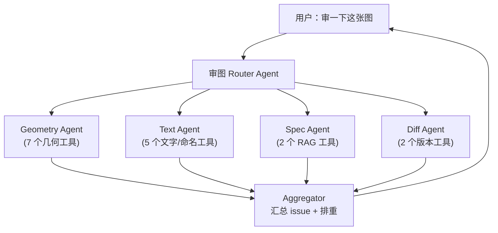
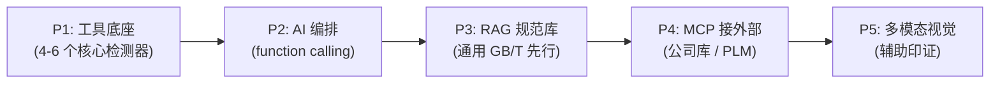

# CAD AI 审图 — 效果可行性与能力边界

> **目的**：把"用大模型审 CAD 图，效果上到底能做到什么程度"这件事讲清楚，避免对内/对外做出做不到的承诺。
> **定位**：能力评估与期望管理文档（**回答"能不能做、做到什么效果"**）。
> **配套**：
> - [ARCH_AGENT_SDK_NATIVE.md](ARCH_AGENT_SDK_NATIVE.md) — 对话后端正式规格（审图以 *recipe* 接入；本文 §3.2 / §6 关于 SDK 能力发挥的讨论在此架构下成立）
> - [CAD_AI_SELECTION_REVIEW.md](CAD_AI_SELECTION_REVIEW.md) — 选区审图 / 反标 的**实现方案**（回答"怎么做"）
> - [ARCH_CAD_REVIEW.md](ARCH_CAD_REVIEW.md) — v0.2 CAD 浏览 + 审图**当前管线**
> - [TASK_SCENARIOS.md](TASK_SCENARIOS.md) — 用户故事

---

## 1. 一句话结论

**能做，且对实际工作有真价值。但价值集中在"形式审查 + 量化校核"，对"专业合规性判断"和"几何/空间专家推理"有限。**

经过工具/MCP/RAG 加持后，可以稳定替专业审图工程师做掉 **70–80% 的常规劳动**，但**不能**替代"懂规范、懂项目、懂场内潜规则"的最终决策。

---

## 2. 不加工具时：大模型在 CAD 审图上的原生能力

把后端送进模型的输入分成 **结构化文本摘要**（ezdxf 摘要）+ **可选截图** 两类，对应能力分布如下。

### 2.1 强项（纯文本即可，可直接上线）

| 任务 | 可靠度 | 价值 |
|------|--------|------|
| 图层是否齐全、是否有"杂物图层" | 高 | 高 |
| 图层 / 块命名规范检查 | 高 | 高 |
| 标题块文字完整性、日期/图号格式 | 高 | 高 |
| 文字内容自相矛盾（标题写 2025、修改记录 2026） | 中-高 | 中 |
| 同一图层内字体混用、SHX 缺失 | 中-高 | 中 |
| `$INSUNITS` 与标注数值口径协调 | 中-高 | 中 |

→ 相当于 **一个熟练 CAD 助理 + 标准检查清单** 的产出。经验上能 catch 60–75% 的形式问题。

### 2.2 不靠谱（即使是多模态视觉）

| 任务 | 实际表现 |
|------|----------|
| 精确引用规范条文（"违反 GB/T 14689-2008 第 4.2.3 条"） | 80% 以上是编造。**不接 RAG 不可用** |
| 干涉 / 间距 / 漏标 等几何性判断 | 必须用算法算，AI 不应介入判定 |
| 视觉读尺寸（看图量数值） | 不可靠。**必须从 DXF 直接读真值** |
| 工程线条图的拓扑理解（管线连通、引线归属） | 错率高 |
| 总布置图功能区位关系（"舵机间是否在艉部") | 多模态模型对线条图能力弱 |

### 2.3 关于多模态截图的现实

直接说：**有用，但只是辅助嗅探，不是主审手段。**

- 主流多模态模型（Claude 4 / GPT-4o）对 **自然图像** 强，对 **工程线条图** 一般。CAD 截图特点：线细、文字密、对比度低、中文 SHX 在低 DPI 像素化。
- 能 catch：标注线明显压住实体、文字明显跑出框、密集冲突、某区域明显"光秃秃"无标注。
- **不能** 稳定 catch：尺寸数值对错、拓扑连接、复杂标注链逻辑。

**让视觉能力实用的工程姿势**（不是模型问题，是渲染问题）：

1. 截图前 **专门为模型重渲一份"高对比清晰版"**（白底黑线 / 加粗 / 大字号），不是把屏幕原样截下来。
2. **局部截图 ≫ 全图截图**（局部信息密度高、噪声少）。
3. 截图永远配合 **结构化文本** 一起喂（"以下是这块的尺寸列表 + 截图，请互相印证"），不要让模型只看图。

---

## 3. 加上工具 / MCP / RAG 之后：能升到什么程度

核心范式：**LLM as orchestrator + 预置工具**。AI 不亲自算几何、不亲自查规范，它的工作是**选对工具、传对参数、解释结果、做综合判断**。

### 3.1 能力升级表

| 原本的弱项 | 解法手段 | 能达到 |
|------------|----------|--------|
| 精确引用规范条文 | RAG 规范库（GB/T、ISO、船级社、企业标准） | 可信引用 |
| 干涉 / 间距校核 | 后端工具：`ezdxf + shapely` 几何运算 | 工程可用 |
| 漏标检测（孔无 DIM、孔无引线） | 后端工具：实体邻域查询 + 规则匹配 | 工程可用 |
| 跨版本 diff | 后端工具：按几何指纹做实体 diff | 工程可用 |
| 视觉读尺寸 | 根本不让 AI 看，直接读 DXF | 完全解决 |
| 标注堆叠 / 压线 | 后端工具：bbox / 线段相交检测 | 工程可用 |
| 管线连通性 | 后端工具：把 LINE/POLYLINE 建图 + 图算法 | 部分解决 |
| 视觉空间推理（"舵机间在哪") | 拆成"语义识别 + 几何定位"两步 | 部分解决 |
| 多模态对线条图识别天花板 | 重渲染高对比版 + 局部截图 | 仅小幅提升，天花板不动 |
| 公司 / 项目"潜规则" | 灌进知识库才行 | 视库的完备度 |

→ 加上工具 / RAG 之后，**审图能力从"勉强能用"升到"专业审图员的高效助理"**。

### 3.2 "现写脚本" vs "预置工具"——选后者

很多人把 agent 想象成"AI 临场写 Python 算几何"。能做，但**这是次优解**：

| 维度 | AI 现写脚本 | 预置好的工具 / MCP |
|------|-------------|---------------------|
| 单次延迟 | 几秒到几十秒（生成 + 执行 + 修错） | 几十毫秒 |
| 正确性 | 临场代码，参数靠模型猜（"附近"=多少米？） | 工程师审过、参数固定、可单元测试 |
| 可复现 | 每次代码可能不一样 | 完全一致 |
| 可审计 | 难，要看代码 | 工具签名固定，调用历史可追 |
| 适合场景 | 探索性 / 长尾问题 | **审图这种重复高频任务** |

**结论**：审图是"同一类检查每天跑无数次"的场景，**应该把检测器封装成预置工具库**，AI 只负责编排调用。让 AI 现写脚本的合理场景仅限于：

- 工具集没覆盖的临时探索（"数一下图里直径 > 200 的圆里有多少螺栓孔"）
- 数据探索阶段，先让 AI 试做法，确认后**固化成新工具**

---

## 4. 工程门槛（容易被忽视的三件事）

### 4.1 工具/MCP 服务本身要有人先写

"AI 调 MCP 解决"的前提是 MCP server 已存在。当前项目的 ToolGateway / MCP 还在骨架阶段。建议的最小 CAD 工具集见 [§6](#6-必备的工具底座清单)。

每个工具 1–3 天活，写一次复用永远，比让 AI 现编可靠 100 倍。

### 4.2 工具一多，AI 会选错

经验值：

- 5 个工具：AI 选对率 ≈ 90%
- 25 个工具：AI 经常选错或漏调

**工程对策**：分层 agent，每个子 agent 只面对 5–8 个工具。



### 4.3 临场写脚本在审图场景风险偏高

审图是给工程师拿来交付决策用的，AI 临场写的几何算法**参数全靠猜**（"距离很近"=多少？"明显冲突"=多少度？），结论可能恰好反了。

**合理姿势**：

- 工具的判定阈值由 **公司/项目配置文件** 决定，不是 AI 决定
- AI 可以改写 **工具调用的参数**，但不能改写 **判定规则本身**
- 工具不够用 → AI 写初稿 → 工程师审 → 固化成新工具

---

## 5. 工具也解不了的两件事

这两件是 AI 路线的本质天花板，不是更多工具 / 更强模型能补的。

### 5.1 "合理性"的判断标准从哪来

"这条尺寸链合不合理" / "这个舱室位置好不好"——**背后是规范、经验、项目惯例**。

如果不把这些灌进库里，AI 没有可引用的依据，只能凭通识乱说。

→ 解法是 **数据资产建设**：规范库 / 公司标准 / 历史项目案例。**不是更强的 AI**。

### 5.2 工程线条图的多模态识别天花板

即使把截图重渲染得再清晰，让模型从图像里数"这片标注里有几个 12000"也不可靠。

→ 解法是 **永远把视觉作为辅助**，主审走 DXF 结构化数据。**这是范式问题，不是参数问题**。

---

## 6. 必备的工具底座清单（建议的 MCP / 内部工具集）

下面是支撑"AI + 工具"审图模式所需的最小工具底座，每个粒度都是"高频复用、能单元测试、参数化"的：

```
mcp-cad-geometry        # 几何计算（纯本地，无外部依赖）
  - measure_distance(handle_a, handle_b)
  - check_interference(layer_filter, min_clearance_mm)
  - compute_dimension_actual(handle)
      # 用 ezdxf 计算几何长度，与文本对照
  - find_orphan_holes(min_diameter)
      # 圆/弧实体附近 N 米内无 DIMENSION
  - detect_overlapping_dims(bbox_tolerance)

mcp-cad-conventions     # 命名 / 图层规范（公司可配置规则集）
  - validate_layer_naming(rule_set_id)
  - check_titleblock_completeness(template_id)
  - detect_unicode_garbled_text()
  - check_font_consistency()

mcp-cad-diff            # 跨版本 / 跨修订
  - diff_dxf(uri_a, uri_b)
      # 按几何指纹匹配实体，输出新增 / 删除 / 修改清单

mcp-cad-spec            # 规范 RAG（接外部知识）
  - search_spec(query, spec_codes)
  - quote_clause(clause_id)
      # 必须返回真实存在的条文文本，不允许凭空生成

mcp-cad-history         # 项目历史 / 企业知识
  - find_similar_drawings(current_dxf)
  - check_against_project_baseline(project_id)
```

**MCP 的真正杠杆点**：连规范库、企业知识库、PLM、ERP 等 **外部世界**。  
本地几何计算放在内部 Python 工具更划算，不必走 MCP。

---

## 7. 针对船舶 / 工业制造场景的现实预期

以你这张「总布置图」为例：

**AI 能高置信度做的事**：

- 列出所有图层、统计实体数量、指出明显异常分布
- 抽出全部 DIMENSION 与 TEXT/MTEXT，检查文字一致性、字体使用、是否有乱码
- 检查标题块字段是否齐全、修改记录格式是否规范
- 命名建议（图层 / 块）
- 拉出"独立成单的尺寸标注"让工程师确认是否冗余

**AI 不能给做的事**：

- 判断"这条尺寸链在船舶设计语境下是否合理"
- 判断"某舱室位置是否符合 SOLAS / 船级社要求"
- 判断"管路布置是否避让结构"

**AI 能做但需先建库的事**：

- "按公司图纸标准审查" → 接公司 CAD 标准 PDF 的 RAG
- "按船级社规范审查" → 接对应规范条款的 RAG，模型仅基于召回内容判断

---

## 8. 落地优先级（推荐重排）

按 **效果 / 投入比** 排序，而不是按"功能完整度"：



| 序号 | 内容 | 为什么这个顺序 |
|------|------|----------------|
| **P1** | 写 4–6 个核心检测器（漏标 / 干涉 / 命名 / 标题块 / diff） | 比花精力调多模态截图 ROI 高 5–10 倍 |
| **P2** | 接 function calling，让 AI 编排这批工具 | 不要让 AI 现写脚本 |
| **P3** | 接通用 CAD 制图规范 RAG（GB/T 17450、GB/T 14689） | 公开规范无版权风险，先填基础 |
| **P4** | MCP 接公司知识库 / 项目历史 / PLM | MCP 真正杠杆点：接外部世界 |
| **P5** | 多模态视觉补充 | **必须先做"为模型重渲高对比图"**，否则效果打折 |

**关键判断**：前两波出来时，效果就已经能让人觉得"哇真的能用"，无需等到多模态。多模态作为"看起来酷"的能力可以晚一步上。

---

## 9. 期望管理（对外文案建议）

不要写"AI 智能审图、媲美专家"。建议这样表述：

> **WFM Studio CAD 审图助手**：
> - 自动完成图层、命名、文字、标注一致性的**形式审查**
> - 在用户选区上对 **尺寸–几何一致性** 做精确比对
> - 把高频重复的检查项从工程师手上拿走，让人把精力留在**专业判断**上
> - 规范条款审查需先导入企业规范库（RAG）后启用

这样的承诺 **做得到、用户也用得爽**，长期价值远高于夸大。

---

## 10. 单页要点速览

| 维度 | 结论 |
|------|------|
| 整体可行性 | 可行，价值真实 |
| 不加工具时上限 | 形式审查（60–75%）+ 命名规范建议 |
| 加工具后上限 | 形式审查 + 几何量化校核 + 规范引用 ≈ 70–80% 常规劳动 |
| 最大投资回报项 | **预置工具底座**（不是多模态视觉、不是 AI 现写脚本） |
| 主要风险 | 工具/规范库要先有人写；AI 选错工具；幻觉条文号 |
| 不能做的 | 真正的"专业合理性"判断、视觉空间专家推理 |
| 关键前置条件 | 数据资产建设（规范、企业标准、历史项目）|
| 视觉的位置 | 仅辅助，且必须为模型重渲高对比图 |
| 现写脚本的位置 | 仅探索性 / 长尾，主流程靠预置工具 |
