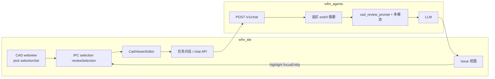

# CAD 选区审图与 AI 反标 — 方案摘要

> **目的**：把「像 HTML XPath 一样复制结构身份信息 → 喂给大模型 →（可选）截图/局部审图 →（可选）审图意见回标到视图」的能力写成可落地的设计说明。  
> **关联**：[ARCH_CAD_REVIEW.md](ARCH_CAD_REVIEW.md)（v0.2 管线）、[TASK_SCENARIOS.md](TASK_SCENARIOS.md)（用户故事 4）。  
> **状态**：本文档描述 **Phase 3（L1–L3）** 目标设计；实现进度以代码与 `ARCH_CAD_REVIEW.md` 为准。

---

## 1. 结论：是否可行

**可行。** 当前栈已具备主要原料：

- 浏览器内 **CAD 真渲染 + 选实体**（`cad-simple-viewer` 的 `pick` / `selectionSet` / `highlight`）。
- **整图或内存 DXF 文本** 可走 `POST /v1/chat` 的 `dxf_text`，后端 `ezdxf` 做摘要（见现有 [parser.py](../wfm-agents/wfm_agents/cad/parser.py)、[recipes.py](../wfm-agents/wfm_agents/cad/recipes.py)）。
- **截图**：WebGL 渲染用 `canvas.toDataURL('image/png')` 即可产出局部/全图 PNG，供多模态模型使用。
- **“CAD 版 XPath”**：以 DXF/DWG 实体的 **`handle`（十六进制唯一句柄）** 为主键，辅以 `layer`、`type`、`bbox` / 插入点，前后端可稳定对齐；后端可用 `doc.entitydb[handle]` 取实体详情。

**不在第一期的部分**：把审图批注**写回**原 `.dwg`/`.dxf` 文件（需可写链路、格式兼容性）；规范库 RAG、批量审图报表等列为后续。

---

## 2. 能力分层（L1–L4）

| 层级 | 能力 | 说明 |
|------|------|------|
| **L1** | 选区 + 文本审图 | 用户点选/框选实体 → 将 handle 列表 + 邻域结构化摘要送进现有审图 recipe，走纯文本 LLM。 |
| **L2** | 局部多模态 | 在 L1 基础上对选区视口 **截 PNG**（可先 `zoomToBox` 再截），随请求带给支持图像的引擎（如 Anthropic）。其它引擎自动降级为仅文本。 |
| **L3** | 反标与双向跳转 | 模型输出约定格式的 **Issue 列表（JSON）** → IDE 侧 Issue 视图 + viewer **高亮 / 定位**；不落盘改原图，可选 sidecar `.wfm/cad-review/*.review.json`。 |
| **L4** | 写回 DXF 图层 | 在导出 DXF 上新增 `WFM_REVIEW_NOTES` 等图层写入 TEXT/引线 — **链路较脆**，单独一期。 |

推荐 **先做 L1 + L2 + L3**，原图保持只读，工程风险可控。

---

## 3. “CAD XPath” 约定

建议统一成可序列化、可粘贴的引用，例如：

```text
dxf://<文件名>#handle=<HEX>&layer=<图层>&type=<实体类型>
```

- **主键**：`handle`（会话内解析得到的 DXF 为准）。  
- **注意**：同一 `.dwg` 经 LibreDWG/WASM 转出的 DXF，**句柄可能与桌面 AutoCAD 另存 DXF 不完全一致**；持久化评审记录时应同时记录 **dxf 内容哈希** 或文件版本，句柄失效时可降级为「图层 + 类型 + 几何邻域」模糊匹配。

---

## 4. 数据流（概览）



1. **Viewer** 上报当前选中实体的 `handle` / `layer` / `type` / `bbox`。  
2. **「审选中」**（或后续右键菜单）组装：`dxf_text`（已有）+ `selection` + 可选 `screenshot_png`。  
3. **`/v1/chat`** 检测审图分支：对选区做 **高密度小摘要**（避免整图百万行 DXF 直塞模型）。  
4. **回复** 含结构化 `wfm-issues` 块时，**Issue 面板** 解析并与 viewer **高亮联动**。

---

## 5. 前端改动范围（遵守 fork 政策）

- **仅限** [`wfm-ide/src/vs/workbench/contrib/wfm/cadReview/`](../wfm-ide/src/vs/workbench/contrib/wfm/cadReview/)：扩展 `cadViewerMessages.ts`、`viewer.js`、`cadViewerEditor.ts`；扩展 `IWfmChatExtras`（`selection`、`screenshotPng`）；可选新增 Issue `ViewPane`。  
- **Vendor** `cad-viewer.iife.js`：若 `WfmCadBootstrap` 未导出所需 API，通过 [scripts/build-cad-viewer.mjs](../wfm-ide/scripts/build-cad-viewer.mjs) 的 entry **补 re-export**（一次性维护）。

**交互策略**：第一版可用工具栏 **「审选中」** 验证闭环；右键菜单可在 webview 内自绘浮层，或与 IDE 原生菜单对接（需坐标透传），作为增强项。

---

## 6. 后端改动范围

- **`POST /v1/chat`**：请求体增加可选 `selection`、`screenshot_png_b64`（或等价字段）。  
- **解析**：[parser.py](../wfm-agents/wfm_agents/cad/parser.py) 增加 `summarize_dxf_text_for_selection(...)`：按 handle 拉实体 + 邻域几何/关联标注。  
- **Recipe**：[recipes.py](../wfm-agents/wfm_agents/cad/recipes.py) 增加选区段、图像说明段；**约定** 模型在回复末尾输出可解析的 issue JSON（如 fenced `wfm-issues`）。  
- **多模态**：仅在已配置的视觉引擎路径组装 image block；其余引擎忽略图片。  
- **持久化**（可选）：`.wfm/cad-review/<相对路径>.review.json`，路径须 **`workspace_root` 内校验**，防越界。

---

## 7. 截图与体验注意

- 截局部图前若 **临时改变视口**（如 zoom 到选区），应在 capture 后 **恢复相机状态**，避免画面跳动。  
- 全图截图 token 成本高、信息密度低；默认 **「有选区 → 局部截图」** 更划算。

---

## 8. 验收要点（摘要）

- 框选后触发审图，对话中能体现 **具体 handle / 图层**。  
- Anthropic（或同等多模态）模式下，答复能结合 **截图** 描述可见矛盾。  
- Issue 列表 **hover/点击** 能在 viewer 内 **高亮 / 聚焦**。  
- 原 CAD 文件 **未被静默改写**；sidecar 仅作补充记录。

---

## 9. 与 ARCH_CAD_REVIEW 的对照

[ARCH_CAD_REVIEW.md §8](ARCH_CAD_REVIEW.md) 中的 Phase 3 候选项，与本方案对应关系：

| ARCH 条目 | 本方案 |
|-----------|--------|
| viewer ↔ 审图意见联动高亮 | L3 |
| 多模态视觉补充 | L2 |
| issue 持久化 `.wfm/cad-review/` | L3 可选 |
| 审图规则库 RAG | 未纳入本文 |
| 批量审图 | 未纳入本文 |

---

## 10. 参考代码位置（便于实现时跳转）

| 组件 | 路径 |
|------|------|
| CAD webview 主进程 | [cadViewerEditor.ts](../wfm-ide/src/vs/workbench/contrib/wfm/cadReview/browser/cadViewerEditor.ts) |
| webview 内脚本 | [viewer.js](../wfm-ide/src/vs/workbench/contrib/wfm/cadReview/browser/media/viewer.js) |
| IPC 类型 | [cadViewerMessages.ts](../wfm-ide/src/vs/workbench/contrib/wfm/cadReview/browser/cadViewerMessages.ts) |
| Chat extras | [wfmAgentClient.ts](../wfm-ide/src/vs/workbench/contrib/wfm/common/wfmAgentClient.ts) |
| DXF 摘要 | [parser.py](../wfm-agents/wfm_agents/cad/parser.py) |
| 审图 prompt | [recipes.py](../wfm-agents/wfm_agents/cad/recipes.py) |
